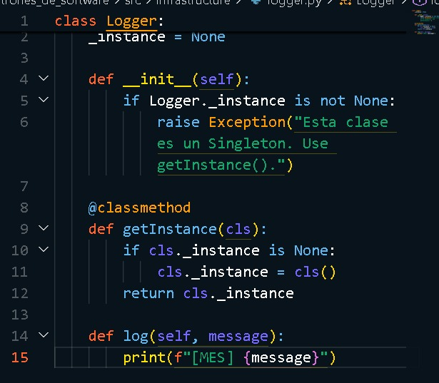
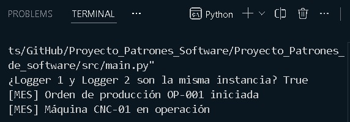

# Semana 1 - Implementación del patrón Singleton

**Asignatura:** Patrones de Software E-195

**Proyecto:** Sistema de Control de Producción (MES)

**Integrantes:**
- Yesica Dayana Rueda Saldarriaga
- Sergio Andrés Mendoza Osorio

## 1. Objetivo

Implementar el patrón de diseño Singleton dentro del Sistema de Control de Producción (MES), utilizando una instancia única para centralizar el registro de eventos del sistema.

## 2. Problema identificado

El sistema MES cuenta con diferentes componentes, como producción y monitoreo de equipos, que necesitan registrar eventos durante la ejecución.

Si cada componente utilizara una instancia diferente del sistema de registro, se podría perder la centralización y consistencia de la información.

Por esta razón, se requiere un único objeto Logger que pueda ser utilizado desde diferentes partes del sistema.

## 3. Implementación

Se implementó la clase `Logger` utilizando una instancia única almacenada en `_instance` y un método `getInstance()` encargado de crearla únicamente cuando sea necesaria y devolverla posteriormente.

La implementación corresponde a una inicialización Lazy, ya que la instancia se crea solamente cuando se solicita por primera vez mediante `getInstance()`.

## 4. Interpretación dentro del MES

El patrón Singleton se utiliza para implementar un Logger centralizado.

Los componentes de producción y equipos pueden acceder al mismo Logger para registrar eventos del sistema. De esta manera, diferentes partes del MES utilizan una única instancia compartida.

La implementación permite evidenciar las características principales del patrón:

- **Una única instancia:** el sistema mantiene un solo objeto `Logger`.
- **Acceso global:** diferentes componentes pueden obtenerlo mediante `getInstance()`.
- **Estado consistente:** todos los componentes utilizan la misma instancia para registrar eventos.

## 5. Uso del Singleton

Desde el programa principal se solicita la instancia del Logger mediante `getInstance()`.

La variable `logger1` y la variable `logger2` obtienen la instancia mediante el mismo método, permitiendo comprobar que ambas referencias corresponden al mismo objeto.

## 6. Prueba de ejecución

Se realizó una prueba solicitando dos veces la instancia del Logger y verificando si ambas referencias corresponden al mismo objeto.

El resultado `True` demuestra que `logger1` y `logger2` corresponden a la misma instancia.

Además, se comprobó su utilización desde diferentes componentes del MES, registrando eventos relacionados con una orden de producción y una máquina CNC.

## 7. Conclusión

La implementación del patrón Singleton permitió centralizar el Logger del MES mediante una única instancia compartida. Esta solución resulta apropiada debido a que diferentes componentes del sistema requieren acceso al mismo servicio de registro.