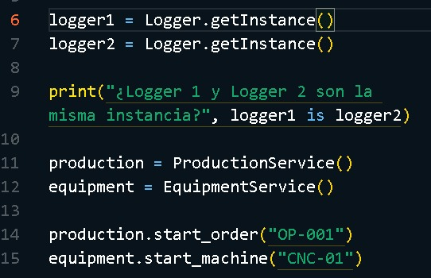
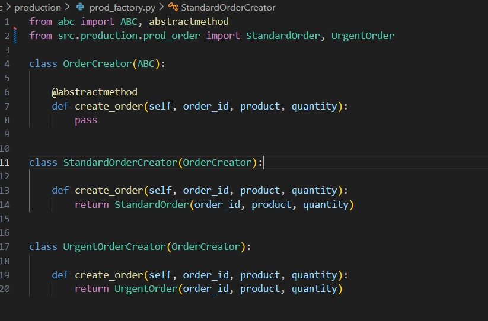
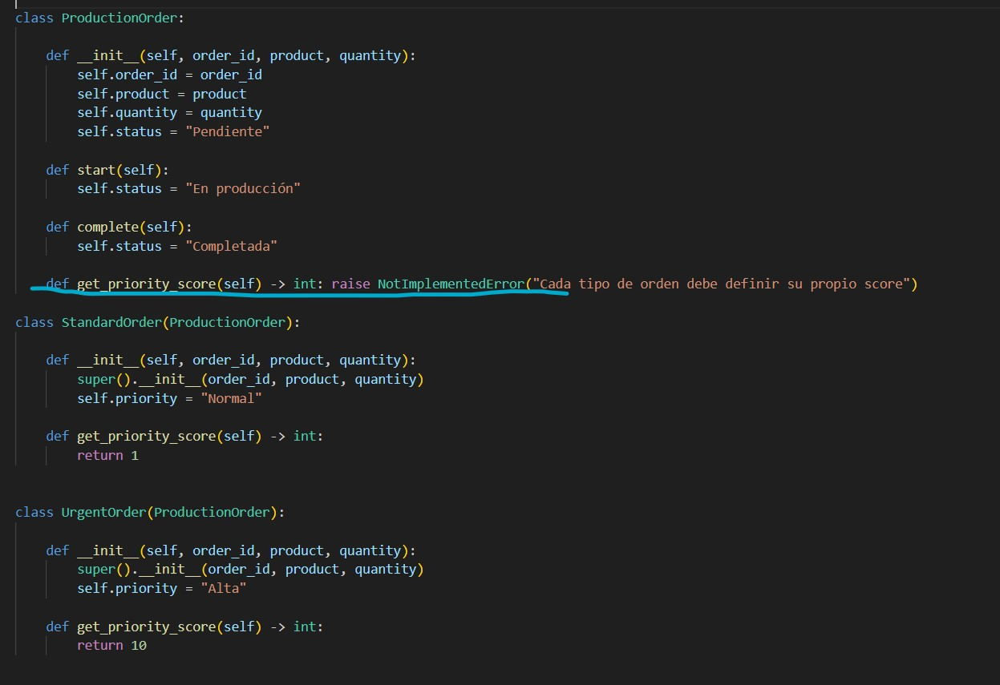
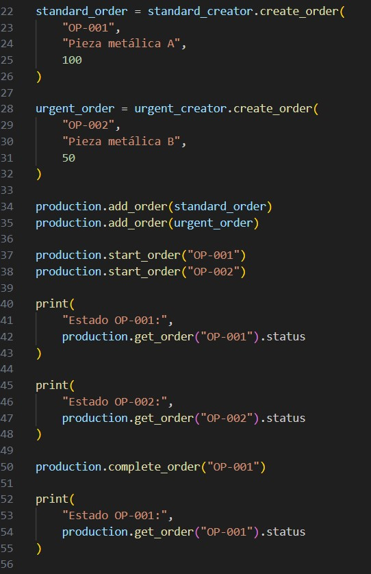
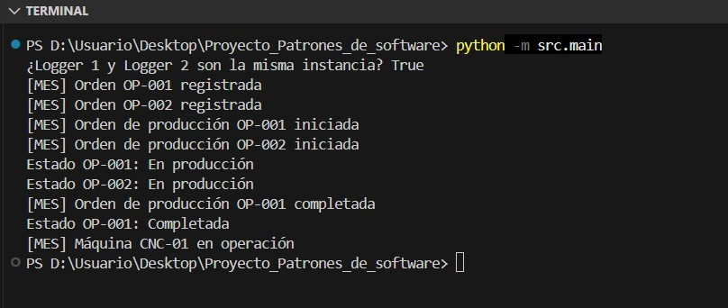
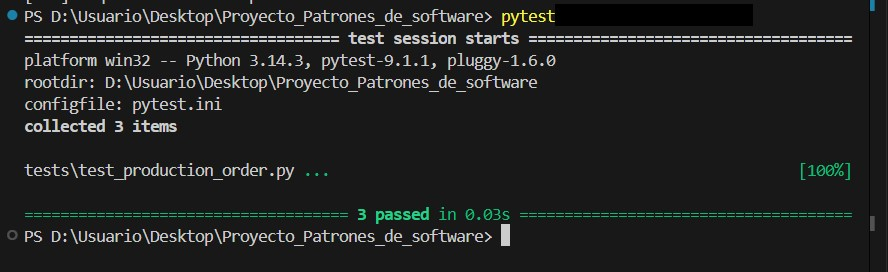

# Semana 4 - Aplicación del patrón Factory Method

**Asignatura:** Patrones de Software E-195

**Proyecto:** Sistema de Control de Producción (MES)

**Integrantes:**

* Yesica Dayana Rueda Saldarriaga
* Sergio Andrés Mendoza Osorio

---

# 1. Introducción

Durante las primeras semanas se realizó la contextualización y análisis del Sistema de Control de Producción (MES), identificando los principales procesos, componentes y necesidades del sistema.

En la primera semana se definió el problema, el objetivo general, los objetivos específicos, el alcance inicial, el indicador OEE, los patrones de diseño que podrían ser utilizados y la arquitectura inicial del sistema.

Durante la segunda semana se profundizó en la problemática, las necesidades del sistema, los procesos principales y los componentes que harán parte del MES.

En la tercera semana se inició la implementación de los patrones de diseño mediante el patrón **Singleton**, aplicado al componente `Logger` para centralizar el registro de eventos.

En esta cuarta etapa se continúa con la implementación de los patrones de diseño identificados previamente, aplicando el patrón **Factory Method** para la creación de diferentes tipos de órdenes de producción.

---

# 2. Contextualización del sistema

En una empresa industrial se maneja una gran cantidad de información relacionada con los procesos de producción, como las órdenes de fabricación, la programación de actividades, el control de calidad, el estado de las máquinas, los tiempos de operación y la trazabilidad de los productos.

A partir de esta necesidad se propone el desarrollo de un **Sistema de Ejecución de Manufactura (MES - Manufacturing Execution System)**, cuyo propósito es centralizar y gestionar la información relacionada con la producción.

El proyecto permitirá aplicar conceptos de ingeniería de software y patrones de diseño, buscando construir un sistema organizado, mantenible y escalable.

El Sistema de Control de Producción (MES) busca gestionar y supervisar diferentes procesos relacionados con la producción industrial.

Entre las funcionalidades contempladas se encuentran:

* Planificación y programación de la producción.
* Gestión y seguimiento de órdenes de producción.
* Control de calidad.
* Trazabilidad de productos y lotes.
* Monitoreo de máquinas y equipos.
* Registro de información de producción.
* Análisis de eficiencia mediante OEE.

El sistema se organiza mediante diferentes componentes, buscando mantener separadas las responsabilidades y facilitar la incorporación progresiva de patrones de diseño.

---

# 3. Objetivo general

Desarrollar un Sistema de Ejecución de Manufactura (MES) que permita gestionar y supervisar los procesos de producción, integrando la planificación, el control de calidad, la trazabilidad, el monitoreo de equipos y el análisis de eficiencia.

---

# 4. Objetivos específicos

1. Identificar y modelar los principales procesos relacionados con la producción industrial.

2. Diseñar un sistema que permita crear, gestionar y realizar seguimiento a las órdenes de producción.

3. Implementar funcionalidades para registrar y consultar información relacionada con el control de calidad.

4. Gestionar la trazabilidad de los productos y lotes durante el proceso de producción.

5. Representar y monitorear el estado de las máquinas y equipos involucrados en la producción.

6. Registrar información relacionada con los tiempos de operación y posibles tiempos de inactividad.

7. Calcular indicadores de eficiencia de producción mediante el indicador OEE.

8. Aplicar patrones de diseño de software que permitan mejorar la organización, mantenibilidad y escalabilidad del sistema.

---

# 5. Alcance inicial

El sistema inicialmente permitirá:

* Crear y gestionar órdenes de producción.
* Consultar el estado de las órdenes.
* Realizar seguimiento al progreso.
* Registrar controles de calidad.
* Gestionar productos y lotes.
* Mantener información de trazabilidad.
* Representar el estado de equipos y máquinas.
* Registrar tiempos de operación y paradas.
* Calcular indicadores de eficiencia.
* Simular un entorno de producción industrial.

La integración directa con maquinaria industrial real y otras funcionalidades avanzadas serán evaluadas posteriormente.

---

# 6. Indicador OEE

El OEE permite medir la eficiencia de los equipos dentro de un proceso productivo.

Está compuesto por:

* **Disponibilidad:** porcentaje de tiempo en que el equipo se encuentra operativo.
* **Rendimiento:** relación entre la producción obtenida y la producción esperada.
* **Calidad:** proporción de productos correctos frente al total producido.

### Fórmula

**OEE = Disponibilidad × Rendimiento × Calidad**

Los módulos de calidad, trazabilidad y cálculo de OEE continuarán desarrollándose durante las siguientes etapas.

---

# 7. Patrones de diseño propuestos

| Patrón             | Estado       | Aplicación                                         |
| ------------------ | ------------ | -------------------------------------------------- |
| **Singleton**      | Implementado | Centralización del Logger.                         |
| **Factory Method** | Implementado | Creación de diferentes tipos de órdenes.           |
| **Observer**       | Pendiente    | Notificación de cambios en equipos.                |
| **Strategy**       | Pendiente    | Diferentes estrategias de producción y eficiencia. |
| **Repository**     | Pendiente    | Separación del acceso a datos.                     |

---

# 8. Arquitectura inicial

El sistema se plantea inicialmente mediante una arquitectura organizada por capas:

```text
Presentación
     ↓
Lógica de negocio
     ↓
Acceso a datos
     ↓
Persistencia
```

Esta separación busca mantener organizadas las responsabilidades de cada componente y facilitar futuras modificaciones y ampliaciones del sistema.

---

# 9. Profundización del análisis

Durante la segunda semana se profundizó en la problemática que busca solucionar el sistema MES.

En un entorno productivo es necesario mantener información actualizada sobre las órdenes de producción, los equipos, los productos, los controles de calidad y los tiempos asociados a cada proceso.

La ausencia de una estructura centralizada puede generar dificultades para consultar el estado de una orden, conocer el estado de una máquina, realizar seguimiento a la producción o calcular indicadores de eficiencia.

Por esta razón, el sistema propuesto busca representar de manera organizada estos procesos y establecer una base que permita posteriormente incorporar nuevas funcionalidades.

---

# 10. Problemática identificada

Entre las principales necesidades identificadas se encuentran:

* Organizar la información de las órdenes de producción.
* Realizar seguimiento al estado de las órdenes.
* Identificar el estado de los equipos.
* Registrar información relacionada con la producción.
* Mantener la trazabilidad de los productos.
* Registrar controles de calidad.
* Obtener indicadores de eficiencia.
* Permitir que el sistema pueda crecer sin generar una estructura difícil de mantener.

Estas necesidades justifican la utilización de patrones de diseño, ya que permiten establecer soluciones reutilizables para problemas comunes de diseño de software.

---

# 11. Análisis inicial de los procesos

A partir de la contextualización se identifican inicialmente los siguientes procesos:

```text
Planificación
     ↓
Orden de producción
     ↓
Producción
     ↓
Control de calidad
     ↓
Trazabilidad
     ↓
Indicadores OEE
```

De manera paralela, el sistema debe mantener información sobre los equipos utilizados durante la producción.

---

# 12. Componentes del sistema

Entre los componentes iniciales identificados se encuentran:

| Componente            | Responsabilidad                                                |
| --------------------- | -------------------------------------------------------------- |
| **ProductionService** | Gestionar procesos relacionados con las órdenes de producción. |
| **EquipmentService**  | Gestionar máquinas y equipos utilizados en la producción.      |
| **Quality**           | Manejar información relacionada con los controles de calidad.  |
| **OEE**               | Procesar indicadores relacionados con la eficiencia.           |
| **Logger**            | Registrar eventos generados por los diferentes componentes.    |

Estos componentes permiten separar las responsabilidades del sistema y establecer una base para la aplicación progresiva de los patrones de diseño.

---

# 13. Implementación del patrón Singleton

Durante la semana anterior se implementó el patrón de diseño **Singleton** dentro del Sistema de Control de Producción.

El objetivo fue utilizar una instancia única para centralizar el registro de eventos mediante la clase `Logger`.

## 13.1 Problema identificado

Diferentes componentes del sistema, como producción y monitoreo de equipos, necesitan registrar eventos durante la ejecución.

Si cada componente utilizara una instancia diferente del sistema de registro, se podría perder la centralización y consistencia de la información.

Por esta razón, se requiere un único objeto `Logger` que pueda ser utilizado desde diferentes partes del sistema.

---

## 13.2 Implementación

Se implementó la clase `Logger` utilizando una instancia única almacenada en `_instance` y un método `getInstance()` encargado de crearla únicamente cuando sea necesaria y devolverla posteriormente.


La implementación corresponde a una inicialización **Lazy**, ya que la instancia se crea solamente cuando se solicita por primera vez mediante `getInstance()`.

---

## 13.3 Interpretación dentro del MES

El patrón Singleton se utiliza para implementar un Logger centralizado.

Los componentes de producción y equipos pueden acceder al mismo Logger para registrar eventos del sistema.

La implementación permite evidenciar:

* **Una única instancia:** el sistema mantiene un solo objeto `Logger`.
* **Acceso global:** diferentes componentes pueden obtenerlo mediante `getInstance()`.
* **Estado consistente:** todos los componentes utilizan la misma instancia para registrar eventos.

---

## 13.4 Uso del Singleton

Desde el programa principal se solicita la instancia del Logger mediante `getInstance()`.



La variable `logger1` y la variable `logger2` obtienen la instancia mediante el mismo método.

Esto permite comprobar que ambas referencias corresponden al mismo objeto.

---

## 13.5 Prueba de ejecución

Se realizó una prueba solicitando dos veces la instancia del Logger y verificando si ambas referencias corresponden al mismo objeto.


El resultado `True` demuestra que `logger1` y `logger2` corresponden a la misma instancia.

Además, se comprobó su utilización desde diferentes componentes del MES, registrando eventos relacionados con una orden de producción y una máquina CNC.

---

## 13.6 Integración con los componentes del MES

La implementación del Singleton se relacionó con los componentes desarrollados para representar el proceso productivo.

Desde `main.py` se utilizan servicios relacionados con:

* Producción.
* Equipos.
* Registro de eventos.

Se trabaja con una orden de producción identificada como `OP-001` y una máquina CNC identificada como `CNC-01`.

Esto permite demostrar que el patrón no se implementa de forma aislada, sino como parte de la estructura del Sistema de Control de Producción.

---

# 14. Aplicación del patrón Factory Method

## 14.1 Objetivo

Aplicar el patrón de diseño Factory Method dentro del Sistema de Control de Producción (MES) para la creación de distintos tipos de orden de producción (`StandardOrder`, `UrgentOrder`), y validar que el patrón resuelve un problema real de diseño en el sistema, no solo que reproduce su estructura.

---

## 14.2 Problema identificado

El MES necesita crear diferentes tipos de orden de producción con prioridades distintas.

Inicialmente se exploró una solución basada en condicionales (`if`/`elif`) para decidir qué tipo de orden crear, lo cual obliga a modificar la lógica de creación cada vez que se agrega un nuevo tipo de orden, por ejemplo una futura `RushOrder`.

Esta situación genera un mayor acoplamiento y dificulta la aplicación del principio de abierto/cerrado (OCP).

Al revisar la primera implementación del patrón, se identificó un problema adicional: aunque la estructura de Factory Method estaba correctamente aplicada, `StandardOrder` y `UrgentOrder` no tenían ningún comportamiento distinto entre sí.

El atributo `priority` existía, pero ningún componente del sistema lo utilizaba.

En ese estado, el patrón tenía la forma correcta, pero no cumplía una función real dentro del sistema.

---

# 15. Implementación

## 15.1 Creator y ConcreteCreators

Se definió `OrderCreator` como clase abstracta con el método `create_order()`, y dos creadores concretos:

* `StandardOrderCreator`
* `UrgentOrderCreator`

Cada uno es responsable de instanciar su respectivo tipo de orden.



---

## 15.2 Comportamiento diferenciado en los productos

Para que el patrón resolviera un problema real, se agregó a `ProductionOrder` el método `get_priority_score()`.

Este método lanza `NotImplementedError` en la clase base, obligando a cada subclase concreta a definir su propio valor.

Los valores implementados son:

```text
StandardOrder → 1
UrgentOrder   → 10
```



De esta manera, cada tipo de orden tiene un comportamiento específico que posteriormente puede ser utilizado por el sistema.

---

# 16. Interpretación dentro del MES

La estructura del patrón dentro del sistema se interpreta de la siguiente manera:

* **Producto (`Product`):** `StandardOrder` y `UrgentOrder`, con comportamiento propio a través de `get_priority_score()`.

* **Creador (`Creator`):** `OrderCreator`, con sus concretos `StandardOrderCreator` y `UrgentOrderCreator`.

* **Cliente:** `main.py`, que ya no instancia las órdenes directamente, sino a través de los creadores concretos.

Con esta estructura, agregar un nuevo tipo de orden, por ejemplo `RushOrder`, implicaría únicamente crear una nueva clase de producto y un nuevo creador concreto, sin modificar `ProductionService` ni el resto del sistema.

Esto permite aplicar el principio de abierto/cerrado y mantener separada la lógica de creación de las órdenes.

---

# 17. Uso del patrón

Desde `main.py` se instancian `StandardOrderCreator` y `UrgentOrderCreator`, y se utiliza `create_order()` para generar las órdenes de producción que luego se registran en `ProductionService`.



La creación de las órdenes queda de esta manera separada de la lógica principal del servicio de producción.

---

# 18. Consumo del comportamiento diferenciado

Se agregó el método `get_pending_queue()` en `ProductionService`.

Este método filtra las órdenes que se encuentran en estado:

```text
Pendiente
```

Posteriormente las ordena según `get_priority_score()`, de forma descendente.


La ordenación se resuelve completamente mediante polimorfismo, sin utilizar `if`/`elif` ni `isinstance` para distinguir el tipo de orden.

De esta manera, el comportamiento definido en cada tipo concreto de orden tiene un efecto real sobre el funcionamiento del sistema.

---

# 19. Prueba de ejecución

Se ejecutó `main.py` para verificar el flujo completo:

1. Creación de órdenes mediante los creadores concretos.
2. Registro de las órdenes.
3. Inicio de las órdenes.
4. Finalización de las órdenes.



---

## 19.1 Pruebas automatizadas

Adicionalmente, se implementaron pruebas automatizadas con `pytest` para validar que el comportamiento diferenciado funciona correctamente.

Las pruebas verifican:

* Que `UrgentOrder` obtiene un score mayor que `StandardOrder`.
* Que `get_pending_queue()` prioriza correctamente las órdenes urgentes.
* Que se excluyen las órdenes que ya no están en estado `"Pendiente"`.



El resultado obtenido fue de **3 pruebas superadas**.

---

# 20. Correcciones y cambios respecto a la semana anterior

Durante esta etapa se realizaron algunos ajustes relacionados con la estructura del proyecto.

* Se corrigió un import inconsistente del `Logger` en `prod_service.py`:

```python
from infrastructure.logger import Logger
```

por:

```python
from src.infrastructure.logger import Logger
```

Esta corrección permitió solucionar el error que se generaba al ejecutar las pruebas desde la raíz del proyecto.

* Se configuró `pytest.ini` en la raíz del proyecto con:

```ini
[pytest]
pythonpath = .
```

Esto permite que las pruebas resuelvan correctamente los imports internos del paquete `src`.

* Quedan pendientes de limpieza algunos comentarios de código muerto en `prod_service.py` y `main.py`, correspondientes a la implementación previa a la introducción del patrón Factory Method.

---

# 21. Estado del proyecto

Con el avance de esta cuarta semana, el proyecto cuenta con dos patrones de diseño implementados:

### Singleton

Implementado para centralizar el registro de eventos mediante `Logger`.

### Factory Method

Implementado para separar la creación de diferentes tipos de órdenes de producción y permitir que cada tipo tenga un comportamiento específico.

Los patrones **Observer**, **Strategy** y **Repository** continúan pendientes y serán evaluados e implementados progresivamente según las necesidades del sistema.

---


# 22. Conclusión

La implementación del patrón Factory Method permitió desacoplar la creación de órdenes de producción del resto del sistema.

Tras identificar que la primera versión del patrón no aportaba un comportamiento real, se complementó con `get_priority_score()` para que el tipo de orden creado tenga un efecto verificable sobre el comportamiento del sistema.

De esta manera:

```text
StandardOrder → prioridad 1
UrgentOrder   → prioridad 10
```

La cola de producción utiliza estos valores para establecer el orden de atención.

La solución se validó mediante pruebas automatizadas y permite aplicar el principio de abierto/cerrado, ya que agregar un nuevo tipo de orden no requeriría modificar `ProductionService`.

Este avance, junto con la implementación previa del patrón Singleton, permite continuar construyendo una arquitectura organizada, reutilizable y escalable para el Sistema de Control de Producción.

---

