# Sistema de Control de Producción (MES) — Documento de Patrones de Diseño

**Asignatura:** Patrones de Software E-195

**Proyecto:** Sistema de Control de Producción (MES)

**Integrantes:**

* Yesica Dayana Rueda Saldarriaga
* Sergio Andrés Mendoza Osorio

---

# 1. Introducción

Este documento reúne, de manera acumulativa, el análisis, la contextualización y la implementación progresiva de los patrones de diseño del Sistema de Control de Producción (MES).

Se parte de la contextualización inicial del sistema (problema, objetivos, alcance, indicador OEE y arquitectura propuesta), y sobre esa base se documenta cada patrón de diseño a medida que se incorpora al proyecto, incluyendo su justificación, implementación, pruebas y evidencia de ejecución.

El estado actual de los patrones implementados se encuentra en la sección "Patrones de diseño propuestos", y las correcciones y cambios generales se consolidan en la sección final del documento.

---

# 2. Contextualización del sistema

En una empresa industrial se maneja una gran cantidad de información relacionada con los procesos de producción, como las órdenes de fabricación, la programación de actividades, el control de calidad, el estado de las máquinas, los tiempos de operación y la trazabilidad de los productos.

A partir de esta necesidad se propone el desarrollo de un **Sistema de Ejecución de Manufactura (MES - Manufacturing Execution System)**, cuyo propósito es centralizar y gestionar la información relacionada con la producción.

El proyecto permitirá aplicar conceptos de ingeniería de software y patrones de diseño, buscando construir un sistema organizado, mantenible y escalable.

El Sistema de Control de Producción (MES) busca gestionar y supervisar diferentes procesos relacionados con la producción industrial.

Entre las funcionalidades contempladas se encuentran:

* Planificación y programación de la producción.
* Gestión y seguimiento de órdenes de producción.
* Control de calidad.
* Trazabilidad de productos y lotes.
* Monitoreo de máquinas y equipos.
* Registro de información de producción.
* Análisis de eficiencia mediante OEE.

El sistema se organiza mediante diferentes componentes, buscando mantener separadas las responsabilidades y facilitar la incorporación progresiva de patrones de diseño.

---

# 3. Objetivo general

Desarrollar un Sistema de Ejecución de Manufactura (MES) que permita gestionar y supervisar los procesos de producción, integrando la planificación, el control de calidad, la trazabilidad, el monitoreo de equipos y el análisis de eficiencia.

---

# 4. Objetivos específicos

1. Identificar y modelar los principales procesos relacionados con la producción industrial.

2. Diseñar un sistema que permita crear, gestionar y realizar seguimiento a las órdenes de producción.

3. Implementar funcionalidades para registrar y consultar información relacionada con el control de calidad.

4. Gestionar la trazabilidad de los productos y lotes durante el proceso de producción.

5. Representar y monitorear el estado de las máquinas y equipos involucrados en la producción.

6. Registrar información relacionada con los tiempos de operación y posibles tiempos de inactividad.

7. Calcular indicadores de eficiencia de producción mediante el indicador OEE.

8. Aplicar patrones de diseño de software que permitan mejorar la organización, mantenibilidad y escalabilidad del sistema.

---

# 5. Alcance inicial

El sistema inicialmente permitirá:

* Crear y gestionar órdenes de producción.
* Consultar el estado de las órdenes.
* Realizar seguimiento al progreso.
* Registrar controles de calidad.
* Gestionar productos y lotes.
* Mantener información de trazabilidad.
* Representar el estado de equipos y máquinas.
* Registrar tiempos de operación y paradas.
* Calcular indicadores de eficiencia.
* Simular un entorno de producción industrial.

El proyecto se desarrolla como un prototipo/simulación de MES: representa procesos, equipos y flujos de producción mediante software, sin integración con maquinaria industrial real ni con sistemas físicos de planta.

---

# 6. Indicador OEE

El OEE permite medir la eficiencia de los equipos dentro de un proceso productivo.

Está compuesto por:

* **Disponibilidad:** porcentaje de tiempo en que el equipo se encuentra operativo.
* **Rendimiento:** relación entre la producción obtenida y la producción esperada.
* **Calidad:** proporción de productos correctos frente al total producido.

### Fórmula

**OEE = Disponibilidad × Rendimiento × Calidad**

Los módulos de calidad, trazabilidad y cálculo de OEE continuarán desarrollándose durante las siguientes etapas.

---

# 7. Patrones de diseño propuestos

| Patrón             | Estado       | Aplicación                                         |
| ------------------ | ------------ | -------------------------------------------------- |
| **Singleton**      | Implementado | Centralización del Logger.                         |
| **Factory Method** | Implementado | Creación de diferentes tipos de órdenes.           |
| **Abstract Factory** | Implementado | Creación de familias de equipos (línea CNC / línea robótica). |
| **Builder**        | Implementado | Construcción flexible de órdenes con datos opcionales (lote, fechas, equipo asignado). |
| **Prototype**      | Implementado | Clonación de órdenes de un mismo lote (tandas de producción). |

---

# 8. Arquitectura inicial

El sistema se plantea inicialmente mediante una arquitectura organizada por capas:

```text
Presentación
     ↓
Lógica de negocio
     ↓
Acceso a datos
     ↓
Persistencia
```

Esta separación busca mantener organizadas las responsabilidades de cada componente y facilitar futuras modificaciones y ampliaciones del sistema.

---

# 9. Profundización del análisis

Durante la segunda semana se profundizó en la problemática que busca solucionar el sistema MES.

En un entorno productivo es necesario mantener información actualizada sobre las órdenes de producción, los equipos, los productos, los controles de calidad y los tiempos asociados a cada proceso.

La ausencia de una estructura centralizada puede generar dificultades para consultar el estado de una orden, conocer el estado de una máquina, realizar seguimiento a la producción o calcular indicadores de eficiencia.

Por esta razón, el sistema propuesto busca representar de manera organizada estos procesos y establecer una base que permita posteriormente incorporar nuevas funcionalidades.

---

# 10. Problemática identificada

Entre las principales necesidades identificadas se encuentran:

* Organizar la información de las órdenes de producción.
* Realizar seguimiento al estado de las órdenes.
* Identificar el estado de los equipos.
* Registrar información relacionada con la producción.
* Mantener la trazabilidad de los productos.
* Registrar controles de calidad.
* Obtener indicadores de eficiencia.
* Permitir que el sistema pueda crecer sin generar una estructura difícil de mantener.

Estas necesidades justifican la utilización de patrones de diseño, ya que permiten establecer soluciones reutilizables para problemas comunes de diseño de software.

---

# 11. Análisis inicial de los procesos

A partir de la contextualización se identifican inicialmente los siguientes procesos:

```text
Planificación
     ↓
Orden de producción
     ↓
Producción
     ↓
Control de calidad
     ↓
Trazabilidad
     ↓
Indicadores OEE
```

De manera paralela, el sistema debe mantener información sobre los equipos utilizados durante la producción.

---

# 12. Componentes del sistema

Entre los componentes iniciales identificados se encuentran:

| Componente            | Responsabilidad                                                |
| --------------------- | -------------------------------------------------------------- |
| **ProductionService** | Gestionar procesos relacionados con las órdenes de producción. |
| **EquipmentService**  | Gestionar máquinas y equipos utilizados en la producción.      |
| **Quality**           | Manejar información relacionada con los controles de calidad.  |
| **OEE**               | Procesar indicadores relacionados con la eficiencia.           |
| **Logger**            | Registrar eventos generados por los diferentes componentes.    |

Estos componentes permiten separar las responsabilidades del sistema y establecer una base para la aplicación progresiva de los patrones de diseño.

---

# 13. Implementación del patrón Singleton

Durante la semana anterior se implementó el patrón de diseño **Singleton** dentro del Sistema de Control de Producción.

El objetivo fue utilizar una instancia única para centralizar el registro de eventos mediante la clase `Logger`.

## 13.1 Problema identificado

Diferentes componentes del sistema, como producción y monitoreo de equipos, necesitan registrar eventos durante la ejecución.

Si cada componente utilizara una instancia diferente del sistema de registro, se podría perder la centralización y consistencia de la información.

Por esta razón, se requiere un único objeto `Logger` que pueda ser utilizado desde diferentes partes del sistema.

---

## 13.2 Implementación

Se implementó la clase `Logger` utilizando una instancia única almacenada en `_instance` y un método `getInstance()` encargado de crearla únicamente cuando sea necesaria y devolverla posteriormente.


La implementación corresponde a una inicialización **Lazy**, ya que la instancia se crea solamente cuando se solicita por primera vez mediante `getInstance()`.

---

## 13.3 Interpretación dentro del MES

El patrón Singleton se utiliza para implementar un Logger centralizado.

Los componentes de producción y equipos pueden acceder al mismo Logger para registrar eventos del sistema.

La implementación permite evidenciar:

* **Una única instancia:** el sistema mantiene un solo objeto `Logger`.
* **Acceso global:** diferentes componentes pueden obtenerlo mediante `getInstance()`.
* **Estado consistente:** todos los componentes utilizan la misma instancia para registrar eventos.

---

## 13.4 Uso del Singleton

Desde el programa principal se solicita la instancia del Logger mediante `getInstance()`.


La variable `logger1` y la variable `logger2` obtienen la instancia mediante el mismo método.

Esto permite comprobar que ambas referencias corresponden al mismo objeto.

---

## 13.5 Prueba de ejecución

Se realizó una prueba solicitando dos veces la instancia del Logger y verificando si ambas referencias corresponden al mismo objeto.


El resultado `True` demuestra que `logger1` y `logger2` corresponden a la misma instancia.

Además, se comprobó su utilización desde diferentes componentes del MES, registrando eventos relacionados con una orden de producción y una máquina CNC.


---
## 13.6 Diagrama UML

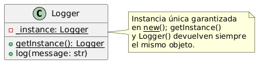

Código PlantUML utilizado para generar el diagrama (planttext.com):

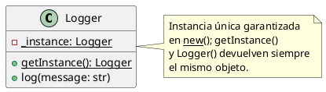

---


## 13.7 Integración con los componentes del MES

La implementación del Singleton se relacionó con los componentes desarrollados para representar el proceso productivo.

Desde `main.py` se utilizan servicios relacionados con:

* Producción.
* Equipos.
* Registro de eventos.

Se trabaja con una orden de producción identificada como `OP-001` y una máquina CNC identificada como `CNC-01`.

Esto permite demostrar que el patrón no se implementa de forma aislada, sino como parte de la estructura del Sistema de Control de Producción.

---

## 13.8 Corrección posterior

Se identificó que la garantía de instancia única no estaba completamente asegurada: el control se realizaba en `__init__`, por lo que instanciar `Logger()` directamente (sin pasar por `getInstance()`) podía generar una segunda instancia.

Se corrigió trasladando el control a `__new__`, de forma que tanto `Logger()` como `getInstance()` devuelven siempre el mismo objeto. Se agregó una prueba automatizada que valida esta garantía.

---

# 14. Aplicación del patrón Factory Method

## 14.1 Objetivo

Aplicar el patrón de diseño Factory Method dentro del Sistema de Control de Producción (MES) para la creación de distintos tipos de orden de producción (`StandardOrder`, `UrgentOrder`), y validar que el patrón resuelve un problema real de diseño en el sistema, no solo que reproduce su estructura.

---

## 14.2 Problema identificado

El MES necesita crear diferentes tipos de orden de producción con prioridades distintas.

Inicialmente se exploró una solución basada en condicionales (`if`/`elif`) para decidir qué tipo de orden crear, lo cual obliga a modificar la lógica de creación cada vez que se agrega un nuevo tipo de orden, por ejemplo una futura `RushOrder`.

Esta situación genera un mayor acoplamiento y dificulta la aplicación del principio de abierto/cerrado (OCP).

Al revisar la primera implementación del patrón, se identificó un problema adicional: aunque la estructura de Factory Method estaba correctamente aplicada, `StandardOrder` y `UrgentOrder` no tenían ningún comportamiento distinto entre sí.

El atributo `priority` existía, pero ningún componente del sistema lo utilizaba.

En ese estado, el patrón tenía la forma correcta, pero no cumplía una función real dentro del sistema.

---

# 15. Implementación

## 15.1 Creator y ConcreteCreators

Se definió `OrderCreator` como clase abstracta con el método `create_order()`, y dos creadores concretos:

* `StandardOrderCreator`
* `UrgentOrderCreator`

Cada uno es responsable de instanciar su respectivo tipo de orden.


---

## 15.2 Comportamiento diferenciado en los productos

Para que el patrón resolviera un problema real, se agregó a `ProductionOrder` el método `get_priority_score()`.

Este método lanza `NotImplementedError` en la clase base, obligando a cada subclase concreta a definir su propio valor.

Los valores implementados son:

```text
StandardOrder → 1
UrgentOrder   → 10
```


De esta manera, cada tipo de orden tiene un comportamiento específico que posteriormente puede ser utilizado por el sistema.

---

# 16. Interpretación dentro del MES

La estructura del patrón dentro del sistema se interpreta de la siguiente manera:

* **Producto (`Product`):** `StandardOrder` y `UrgentOrder`, con comportamiento propio a través de `get_priority_score()`.

* **Creador (`Creator`):** `OrderCreator`, con sus concretos `StandardOrderCreator` y `UrgentOrderCreator`.

* **Cliente:** `main.py`, que ya no instancia las órdenes directamente, sino a través de los creadores concretos.

Con esta estructura, agregar un nuevo tipo de orden, por ejemplo `RushOrder`, implicaría únicamente crear una nueva clase de producto y un nuevo creador concreto, sin modificar `ProductionService` ni el resto del sistema.

Esto permite aplicar el principio de abierto/cerrado y mantener separada la lógica de creación de las órdenes.

---

# 17. Uso del patrón

Desde `main.py` se instancian `StandardOrderCreator` y `UrgentOrderCreator`, y se utiliza `create_order()` para generar las órdenes de producción que luego se registran en `ProductionService`.


La creación de las órdenes queda de esta manera separada de la lógica principal del servicio de producción.

---

# 18. Consumo del comportamiento diferenciado

Se agregó el método `get_pending_queue()` en `ProductionService`.

Este método filtra las órdenes que se encuentran en estado:

```text
Pendiente
```

Posteriormente las ordena según `get_priority_score()`, de forma descendente.

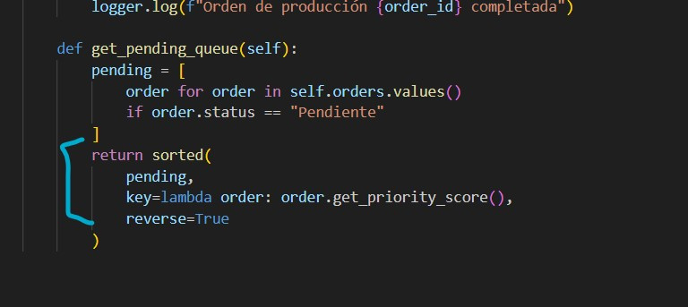

La ordenación se resuelve completamente mediante polimorfismo, sin utilizar `if`/`elif` ni `isinstance` para distinguir el tipo de orden.

De esta manera, el comportamiento definido en cada tipo concreto de orden tiene un efecto real sobre el funcionamiento del sistema.

---

# 19. Prueba de ejecución

Se ejecutó `main.py` para verificar el flujo completo:

1. Creación de órdenes mediante los creadores concretos.
2. Registro de las órdenes.
3. Inicio de las órdenes.
4. Finalización de las órdenes.


---

## 19.1 Pruebas automatizadas

Adicionalmente, se implementaron pruebas automatizadas con `pytest` para validar que el comportamiento diferenciado funciona correctamente.

Las pruebas verifican:

* Que `UrgentOrder` obtiene un score mayor que `StandardOrder`.
* Que `get_pending_queue()` prioriza correctamente las órdenes urgentes.
* Que se excluyen las órdenes que ya no están en estado `"Pendiente"`.


El resultado obtenido fue de **3 pruebas superadas**.

---


## 19.2 Evidencia de video

*(El archivo de video supera el límite de tamaño admitido por GitHub para incluirse directamente en el repositorio. Se subio a un servicio externo como Google Drive o YouTube en modo no listado aquí.)*

[Ver video de la prueba](https://www.youtube.com/watch?v=SWhTslEtTYQ)

---
## 19.3 Diagrama UML

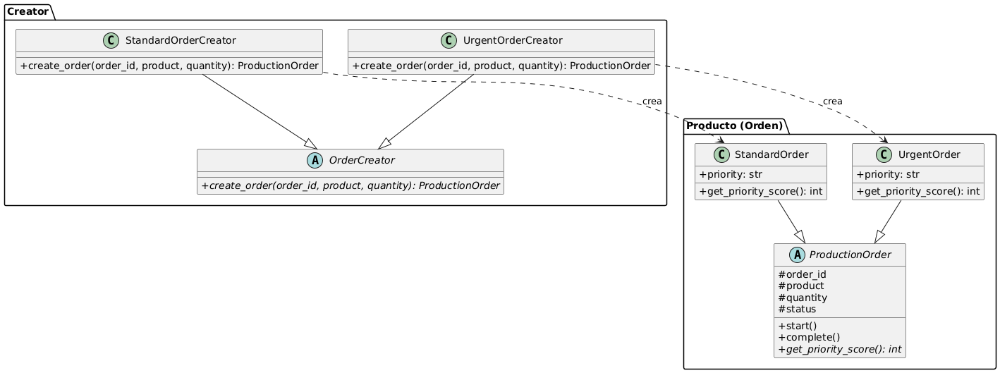

Código PlantUML utilizado para generar el diagrama (planttext.com):

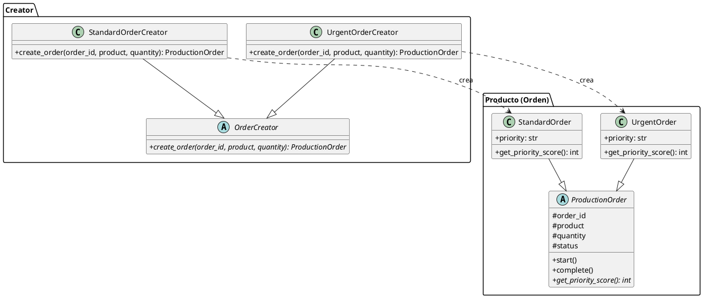

---

# 20. Aplicación del patrón Abstract Factory

## 20.1 Objetivo

Aplicar el patrón Abstract Factory para la creación de familias de equipos de producción (línea CNC y línea robótica) del MES, garantizando que los componentes de una misma familia (equipo + inspección) se creen siempre de forma consistente, sin mezclarse con los de otra familia.

---

## 20.2 Problema identificado

El sistema necesita representar distintas tecnologías de producción (por ejemplo, celdas CNC y celdas robóticas), cada una compuesta por un equipo y un tipo de inspección asociado que deben ser coherentes entre sí (una máquina CNC no debe combinarse con una inspección pensada para ensamble robótico).

Aplicar nuevamente Factory Method sobre este problema no resolvería la necesidad real, ya que ese patrón crea un único producto a la vez; aquí se requiere crear **familias completas de productos relacionados** desde un mismo punto de creación.

Antes de esta implementación, `EquipmentService` no representaba ningún equipo real: `start_machine()` solo registraba un mensaje a partir de un identificador de texto, sin ningún objeto de dominio detrás.

---

## 20.3 Implementación

### 20.3.1 Productos abstractos

Se definieron dos interfaces base: `Equipment` (con `start()`, `stop()` y estado) e `Inspection` (con `inspect()`).

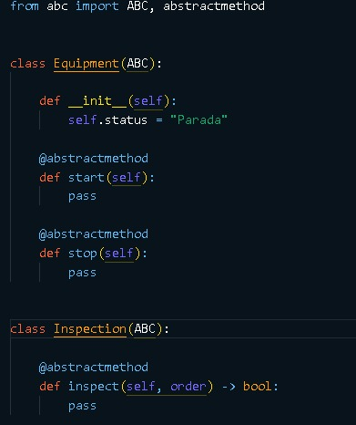

### 20.3.2 Productos concretos y fábricas concretas

Se implementaron dos familias:

* **Línea CNC:** `CNCMachine` + `CNCInspection`.
* **Línea robótica:** `RobotArm` + `RobotInspection`.

Cada familia se agrupa mediante una fábrica concreta que hereda de `AbstractProductionCellFactory`:

* `CNCCellFactory` → crea `CNCMachine` + `CNCInspection`.
* `RobotCellFactory` → crea `RobotArm` + `RobotInspection`.

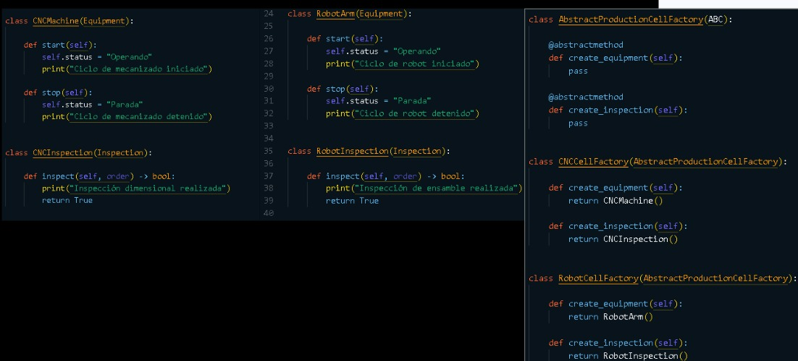

---

## 20.4 Interpretación dentro del MES

* **Productos abstractos:** `Equipment`, `Inspection`.
* **Productos concretos:** `CNCMachine`/`CNCInspection` (familia CNC), `RobotArm`/`RobotInspection` (familia robótica).
* **Fábrica abstracta:** `AbstractProductionCellFactory`.
* **Fábricas concretas:** `CNCCellFactory`, `RobotCellFactory`.
* **Cliente:** `EquipmentService`, que recibe una única fábrica en su constructor y crea a partir de ella tanto el equipo como la inspección, garantizando que ambos pertenezcan a la misma familia.

Agregar una nueva línea de producción en el futuro implicaría únicamente crear sus productos concretos y su fábrica concreta, sin modificar `EquipmentService`.

---

## 20.5 Uso del patrón

`EquipmentService` recibe la fábrica en su constructor y delega en ella la creación del equipo y la inspección. También se actualizó para registrar sus eventos a través del `Logger` centralizado, en lugar de mensajes de consola independientes.

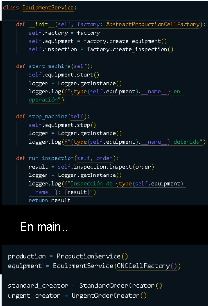

---

## 20.6 Prueba de ejecución

Se ejecutó `main.py` utilizando `CNCCellFactory`, verificando que el equipo y la inspección creados correspondan a la misma familia y que los eventos se registren mediante el Logger.

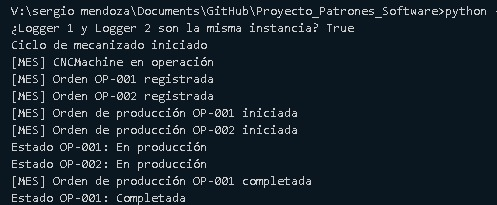

### 20.6.1 Pruebas automatizadas

Se implementaron pruebas que verifican:

* Que cada fábrica concreta crea los productos correspondientes a su propia familia.
* Que ninguna fábrica combina productos de familias distintas (por ejemplo, un `CNCMachine` con una `RobotInspection`).
* Que `EquipmentService` refleja correctamente la familia de la fábrica recibida.
* Que `start_machine()`/`stop_machine()` cambian correctamente el estado del equipo.

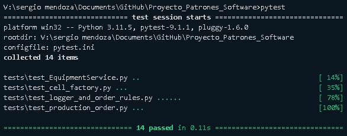

El resultado obtenido fue de **14 pruebas superadas** en total sobre el proyecto.


---

## 20.8 Diagrama UML

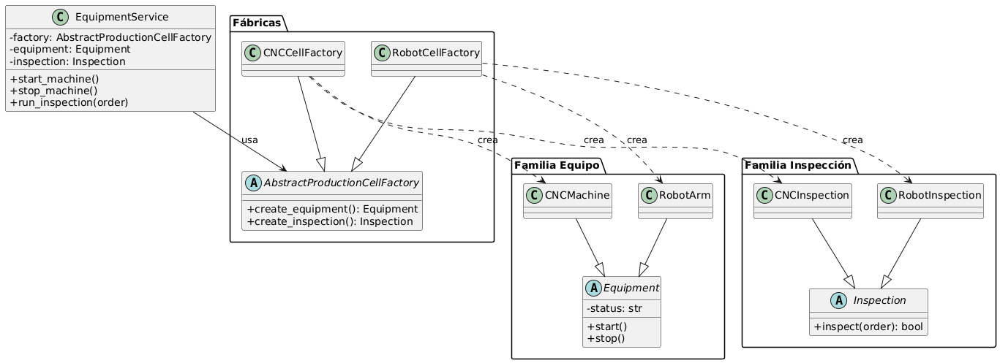

Código PlantUML utilizado para generar el diagrama (planttext.com):

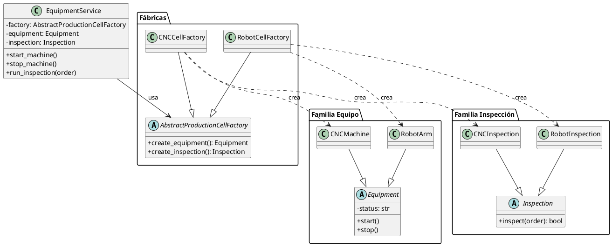


---
# 21. Aplicación del patrón Builder

## 21.1 Objetivo

Aplicar el patrón Builder para la construcción de órdenes de producción con datos opcionales (lote, fechas, descripción, equipo asignado), evitando un constructor con demasiados parámetros y permitiendo configurar solo lo que cada orden necesita.

---

## 21.2 Problema identificado

Al robustecer el dominio del MES, `ProductionOrder` pasó de tener 3 parámetros obligatorios a incorporar 5 datos adicionales opcionales (lote, fecha de ingreso, fecha de entrega, descripción, equipo asignado). Construir una orden directamente con el constructor, indicando todos estos valores en orden, se vuelve difícil de leer y propenso a errores, especialmente cuando la mayoría de los datos son opcionales.

Se descartó incorporar la decisión del tipo de orden (Standard/Urgent) dentro del propio Builder, ya que esa responsabilidad ya la resuelve el patrón Factory Method implementado previamente; hacerlo hubiera duplicado la misma decisión en dos patrones distintos.

---

## 21.3 Implementación

Se implementó `OrderBuilder` como builder fluido (fluent builder): cada método `with_*()` configura un dato opcional y retorna la misma instancia (`self`), permitiendo encadenar llamadas. El método `build()` no decide el tipo de orden: únicamente arma y retorna los datos necesarios.

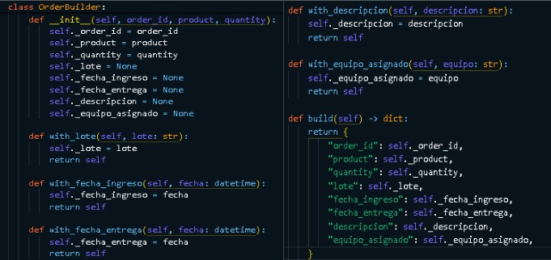

La creación del tipo de orden concreto sigue a cargo del Factory Method existente: `StandardOrderCreator`/`UrgentOrderCreator` reciben los datos ya construidos por el Builder y crean la orden correspondiente.

---

## 21.4 Interpretación dentro del MES

* **Builder:** `OrderBuilder`, con sus métodos `with_lote()`, `with_fecha_ingreso()`, `with_fecha_entrega()`, `with_descripcion()`, `with_equipo_asignado()` y `build()`.
* **Producto del Builder:** un diccionario con los datos de la orden (no la orden en sí).
* **Consumidor del producto:** `StandardOrderCreator`/`UrgentOrderCreator` (Factory Method), que reciben ese diccionario para construir la orden concreta.

Esta división mantiene una responsabilidad única por patrón: el Builder arma los datos; el Factory Method decide y construye el tipo concreto.

---

## 21.5 Uso del patrón

Desde `main.py` se utiliza `OrderBuilder` de forma encadenada para construir los datos de una orden urgente con información adicional, y de forma mínima para una orden estándar que solo requiere los datos obligatorios. También se amplió la ejecución para mostrar en consola los datos construidos y la cola de órdenes pendientes (`get_pending_queue()`), evidenciando la integración entre Builder, Factory Method y la cola de producción.

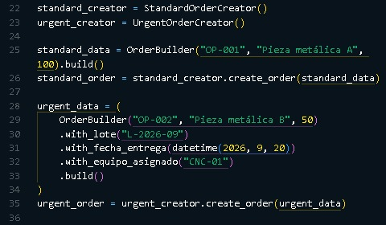

---

## 21.6 Prueba de ejecución

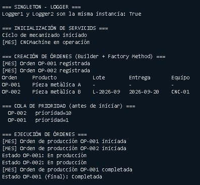

### 21.6.1 Pruebas automatizadas

Se implementaron pruebas que verifican que el Builder produce correctamente los datos con solo los campos obligatorios, y que un `Creator` concreto construye la orden final utilizando los datos configurados mediante el Builder.

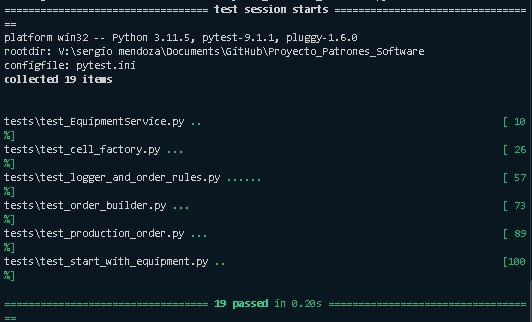

---

## 21.7 Diagrama UML

*(Incluye únicamente las clases que participan en este patrón: `OrderBuilder`, `ProductionOrder` y los creadores concretos que consumen sus datos.)*

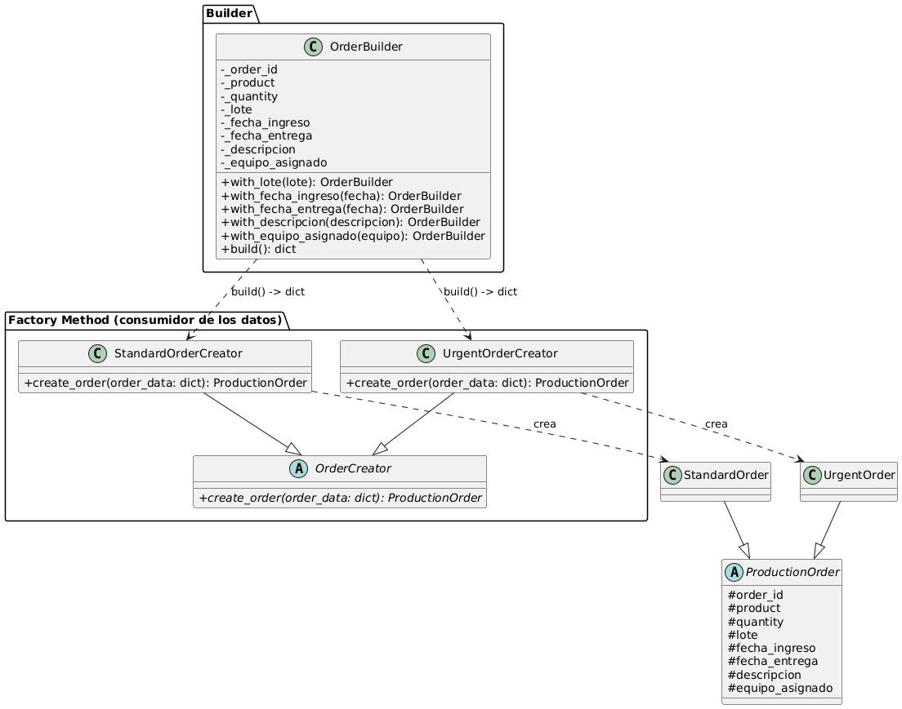

Código PlantUML utilizado para generar el diagrama (planttext.com):

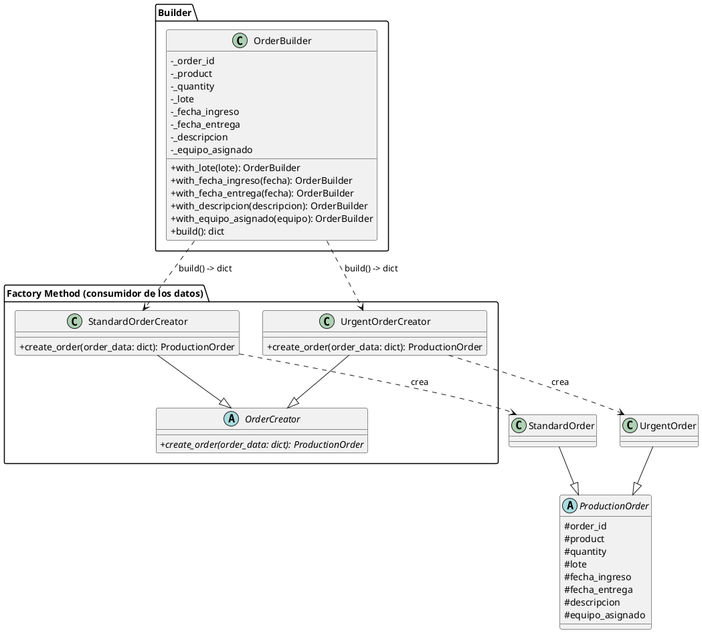


---

# 22. Aplicación del patrón Prototype

## 22.1 Objetivo

Aplicar el patrón Prototype para clonar órdenes de producción que pertenecen a un mismo lote, evitando repetir la configuración completa (lote, fecha de entrega, equipo asignado) cada vez que se crea una orden similar dentro del mismo lote.

---

## 22.2 Problema identificado

El campo `lote`, incorporado junto con el patrón Builder, no tenía hasta ahora ningún uso real dentro del sistema. En un entorno de producción, es común que un mismo lote se fabrique en varias tandas (varias órdenes con el mismo producto, fecha de entrega y equipo asignado, pero con cantidades distintas).

Construir cada orden de una tanda repitiendo toda la cadena de `OrderBuilder` es innecesario cuando la mayoría de los datos ya están definidos por una orden plantilla del mismo lote. Se requiere una forma de reutilizar esa configuración ya construida, generando copias independientes con solo los datos que cambian entre tandas (`order_id` y `quantity`).

---

## 22.3 Implementación

Se agregó el método `clone(new_order_id, new_quantity=None)` en `ProductionOrder`, heredado sin modificaciones por `StandardOrder` y `UrgentOrder`. Utiliza `copy.deepcopy()` para generar una copia completamente independiente de la orden original, y fuerza explícitamente el `status` de la copia a `"Pendiente"`, sin importar el estado en que se encuentre la orden original.


---

## 22.4 Interpretación dentro del MES

* **Prototipo:** `ProductionOrder`, con el método `clone()` que heredan `StandardOrder` y `UrgentOrder`.
* **Cliente:** `main.py`, que construye una orden plantilla (mediante `OrderBuilder` + Factory Method) y genera copias de esa plantilla para representar distintas tandas del mismo lote.

A diferencia de Abstract Factory (que crea familias completas desde cero) y de Builder (que arma los datos paso a paso), Prototype reutiliza un objeto ya construido, cambiando únicamente lo que distingue a cada copia.

---

## 22.5 Uso del patrón

Desde `main.py` se crea una orden plantilla del lote mediante `OrderBuilder` y `UrgentOrderCreator`, y se generan dos copias adicionales mediante `clone()`, representando tandas distintas del mismo lote con cantidades diferentes.

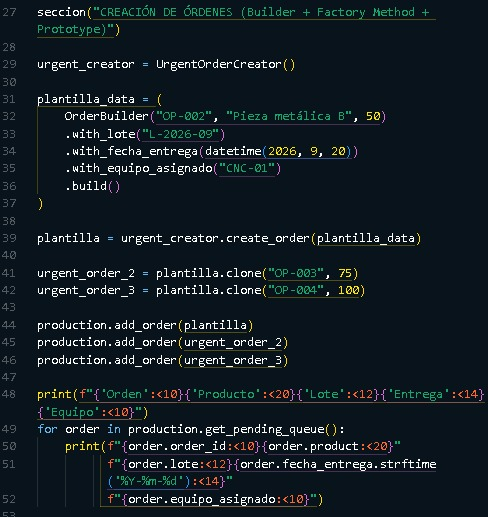

---

## 22.6 Prueba de ejecución

Se ejecutó `main.py`, registrando las tres órdenes del lote (la plantilla y sus dos clones) en `ProductionService`, y mostrando la cola de prioridad con las tres órdenes.

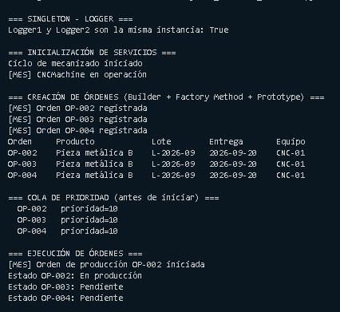

### 22.6.1 Pruebas automatizadas

Se implementaron pruebas que verifican que la orden clonada es una instancia distinta de la original, que conserva `lote`, `fecha_entrega` y `equipo_asignado`, que recibe un nuevo `order_id` y una nueva `quantity`, y que su estado es `"Pendiente"` incluso si la orden original ya se encuentra `"Completada"`.

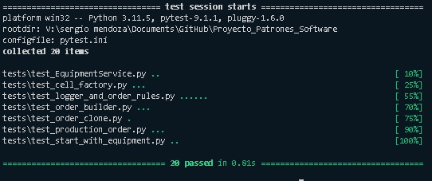

El resultado obtenido fue de **20 pruebas superadas** en total sobre el proyecto.

---

## 22.7 Diagrama UML

*(Incluye únicamente las clases que participan en este patrón: `ProductionOrder`, con el método `clone()`, y sus subclases `StandardOrder`/`UrgentOrder`, que lo heredan sin modificarlo.)*

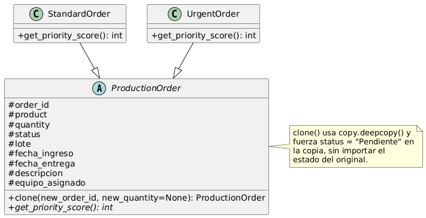

Código PlantUML utilizado para generar el diagrama (planttext.com):

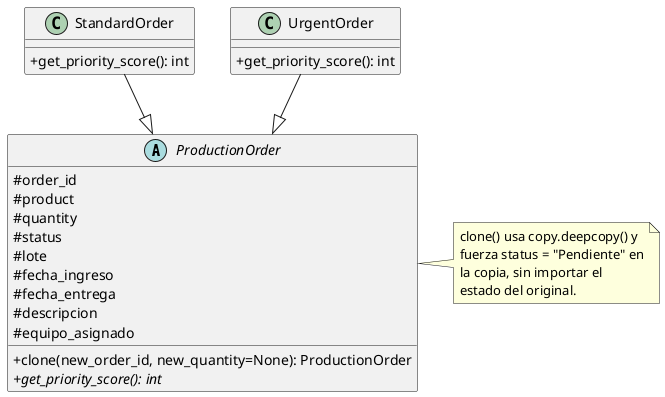

---

# 23. Estado del proyecto

Con este avance, el proyecto cuenta con cinco patrones de diseño implementados:

### Singleton

Implementado para centralizar el registro de eventos mediante `Logger`, con garantía de instancia única.

### Factory Method

Implementado para separar la creación de diferentes tipos de órdenes de producción y permitir que cada tipo tenga un comportamiento específico.

### Abstract Factory

Implementado para la creación de familias completas de equipos de producción (línea CNC y línea robótica), garantizando la consistencia entre el equipo y su inspección asociada.

### Builder

Implementado para construir órdenes de producción con datos opcionales de forma flexible y legible, sin interferir con la responsabilidad de creación ya resuelta por Factory Method.

### Prototype

Implementado para clonar órdenes de un mismo lote a partir de una orden plantilla, evitando repetir la configuración completa por cada tanda de producción.

Los patrones adicionales que se incorporen quedarán sujetos a lo indicado en el desarrollo de la asignatura.

---

# 24. Conclusión general

La implementación del patrón Factory Method permitió desacoplar la creación de órdenes de producción del resto del sistema, dándole un comportamiento real mediante `get_priority_score()`:

```text
StandardOrder → prioridad 1
UrgentOrder   → prioridad 10
```

La cola de producción utiliza estos valores para establecer el orden de atención, validado mediante pruebas automatizadas.

Sobre esa base, la implementación del patrón Abstract Factory permitió representar familias completas de equipos de producción, asegurando que sus componentes (equipo e inspección) no se mezclen entre sí, y evitando repetir el mismo patrón de creación ya resuelto por Factory Method.

Posteriormente, el patrón Builder permitió que el crecimiento del dominio (nuevos datos de la orden) no complicara su construcción, manteniendo una responsabilidad clara y separada del Factory Method: uno arma los datos, el otro decide y construye el tipo concreto.

Finalmente, el patrón Prototype le dio un uso real al campo `lote`, permitiendo representar tandas de un mismo lote de producción mediante clonación, en lugar de reconstruir cada orden desde cero.

Con los patrones Singleton, Factory Method, Abstract Factory, Builder y Prototype implementados y probados (20 pruebas automatizadas en total), el proyecto cuenta con una base organizada, reutilizable y escalable para continuar incorporando los módulos y patrones pendientes del sistema.

---

# 25. Correcciones y cambios generales

Esta sección consolida los ajustes y correcciones realizados sobre el código durante el desarrollo del proyecto, independientemente del patrón en el que se originaron.

* Se configuró `pytest.ini` en la raíz del proyecto (`pythonpath = .`) para que las pruebas resuelvan correctamente los imports internos del paquete `src`.

* Se corrigió la garantía de instancia única del Singleton: el control se trasladó de `__init__` a `__new__`, ya que instanciar `Logger()` directamente podía generar una segunda instancia. Se agregó una prueba automatizada que valida esta garantía.

* `ProductionOrder` se convirtió en clase abstracta real (`ABC`), con `get_priority_score()` como método abstracto, impidiendo instanciarla directamente.

* Se agregaron validaciones de reglas de negocio en `ProductionService`: `add_order()` rechaza un `order_id` duplicado, `start_order()` solo es válido si la orden está en estado `"Pendiente"`, y `complete_order()` solo si está en estado `"En producción"`.

* Se amplió `ProductionOrder` con los campos opcionales `lote`, `fecha_ingreso`, `fecha_entrega`, `descripcion` y `equipo_asignado` (valor por defecto `None`, sin afectar el comportamiento previo), como base para el patrón Builder.

* Se agregó `start_order_with_equipment()` en `ProductionService`, que valida que el equipo asignado esté en estado `"Operando"` antes de iniciar una orden. `start_order()` se mantiene sin cambios para los casos que no requieren esta validación.

* Se actualizó `main.py` para reflejar en la ejecución los datos construidos por el Builder y el uso de `get_pending_queue()`.

* Se agregó el método `clone()` en `ProductionOrder` (patrón Prototype), cubierto por pruebas automatizadas que verifican independencia de la copia y reinicio forzado del estado a `"Pendiente"`.

* Todas las correcciones anteriores quedaron cubiertas por pruebas automatizadas.
