# Sistema de Control de Producción (MES) — Documento de Patrones de Diseño

**Asignatura:** Patrones de Software E-195

**Proyecto:** Sistema de Control de Producción (MES)

**Integrantes:**

* Yesica Dayana Rueda Saldarriaga
* Sergio Andrés Mendoza Osorio

---

# 1. Introducción

Este documento reúne, de manera acumulativa, el análisis, la contextualización y la implementación progresiva de los patrones de diseño del Sistema de Control de Producción (MES).

Se parte de la contextualización inicial del sistema (problema, objetivos, alcance, indicador OEE y arquitectura propuesta), y sobre esa base se documenta cada patrón de diseño a medida que se incorpora al proyecto, incluyendo su justificación, implementación, pruebas y evidencia de ejecución.

El estado actual de los patrones implementados se encuentra en la sección "Patrones de diseño propuestos", y las correcciones y cambios generales se consolidan en la sección final del documento.

---

# 2. Contextualización del sistema

En una empresa industrial se maneja una gran cantidad de información relacionada con los procesos de producción, como las órdenes de fabricación, la programación de actividades, el control de calidad, el estado de las máquinas, los tiempos de operación y la trazabilidad de los productos.

A partir de esta necesidad se propone el desarrollo de un **Sistema de Ejecución de Manufactura (MES - Manufacturing Execution System)**, cuyo propósito es centralizar y gestionar la información relacionada con la producción.

El proyecto permitirá aplicar conceptos de ingeniería de software y patrones de diseño, buscando construir un sistema organizado, mantenible y escalable.

El Sistema de Control de Producción (MES) busca gestionar y supervisar diferentes procesos relacionados con la producción industrial.

Entre las funcionalidades contempladas se encuentran:

* Planificación y programación de la producción.
* Gestión y seguimiento de órdenes de producción.
* Control de calidad.
* Trazabilidad de productos y lotes.
* Monitoreo de máquinas y equipos.
* Registro de información de producción.
* Análisis de eficiencia mediante OEE.

El sistema se organiza mediante diferentes componentes, buscando mantener separadas las responsabilidades y facilitar la incorporación progresiva de patrones de diseño.

---

# 3. Objetivo general

Desarrollar un Sistema de Ejecución de Manufactura (MES) que permita gestionar y supervisar los procesos de producción, integrando la planificación, el control de calidad, la trazabilidad, el monitoreo de equipos y el análisis de eficiencia.

---

# 4. Objetivos específicos

1. Identificar y modelar los principales procesos relacionados con la producción industrial.

2. Diseñar un sistema que permita crear, gestionar y realizar seguimiento a las órdenes de producción.

3. Implementar funcionalidades para registrar y consultar información relacionada con el control de calidad.

4. Gestionar la trazabilidad de los productos y lotes durante el proceso de producción.

5. Representar y monitorear el estado de las máquinas y equipos involucrados en la producción.

6. Registrar información relacionada con los tiempos de operación y posibles tiempos de inactividad.

7. Calcular indicadores de eficiencia de producción mediante el indicador OEE.

8. Aplicar patrones de diseño de software que permitan mejorar la organización, mantenibilidad y escalabilidad del sistema.

---

# 5. Alcance inicial

El sistema inicialmente permitirá:

* Crear y gestionar órdenes de producción.
* Consultar el estado de las órdenes.
* Realizar seguimiento al progreso.
* Registrar controles de calidad.
* Gestionar productos y lotes.
* Mantener información de trazabilidad.
* Representar el estado de equipos y máquinas.
* Registrar tiempos de operación y paradas.
* Calcular indicadores de eficiencia.
* Simular un entorno de producción industrial.

El proyecto se desarrolla como un prototipo/simulación de MES: representa procesos, equipos y flujos de producción mediante software, sin integración con maquinaria industrial real ni con sistemas físicos de planta.

---

# 6. Indicador OEE

El OEE permite medir la eficiencia de los equipos dentro de un proceso productivo.

Está compuesto por:

* **Disponibilidad:** porcentaje de tiempo en que el equipo se encuentra operativo.
* **Rendimiento:** relación entre la producción obtenida y la producción esperada.
* **Calidad:** proporción de productos correctos frente al total producido.

### Fórmula

**OEE = Disponibilidad × Rendimiento × Calidad**

Los módulos de calidad, trazabilidad y cálculo de OEE continuarán desarrollándose durante las siguientes etapas.

---

# 7. Patrones de diseño propuestos

| Patrón             | Estado       | Aplicación                                         |
| ------------------ | ------------ | -------------------------------------------------- |
| **Singleton**      | Implementado | Centralización del Logger.                         |
| **Factory Method** | Implementado | Creación de diferentes tipos de órdenes.           |
| **Abstract Factory** | Implementado | Creación de familias de equipos (línea CNC / línea robótica). |
| **Builder**        | Implementado | Construcción flexible de órdenes con datos opcionales (lote, fechas, equipo asignado). |
| **Prototype**      | Implementado | Clonación de órdenes de un mismo lote (tandas de producción). |
| **Adapter**        | Implementado | Integración del módulo `logging` de Python sin cambiar la interfaz existente de `Logger`. |
| **Bridge**         | Evaluado — no aplicado | Analizado; no se identificó una necesidad real de separar dos dimensiones de variación (ver justificación). |
| **Composite**      | Pendiente    | Por analizar en la siguiente etapa. |
| **Decorator**      | Pendiente    | Por analizar en la siguiente etapa. |

---

# 8. Arquitectura inicial

El sistema se plantea inicialmente mediante una arquitectura organizada por capas:

```text
Presentación
     ↓
Lógica de negocio
     ↓
Acceso a datos
     ↓
Persistencia
```

Esta separación busca mantener organizadas las responsabilidades de cada componente y facilitar futuras modificaciones y ampliaciones del sistema.

---

# 9. Profundización del análisis

Durante la segunda semana se profundizó en la problemática que busca solucionar el sistema MES.

En un entorno productivo es necesario mantener información actualizada sobre las órdenes de producción, los equipos, los productos, los controles de calidad y los tiempos asociados a cada proceso.

La ausencia de una estructura centralizada puede generar dificultades para consultar el estado de una orden, conocer el estado de una máquina, realizar seguimiento a la producción o calcular indicadores de eficiencia.

Por esta razón, el sistema propuesto busca representar de manera organizada estos procesos y establecer una base que permita posteriormente incorporar nuevas funcionalidades.

---

# 10. Problemática identificada

Entre las principales necesidades identificadas se encuentran:

* Organizar la información de las órdenes de producción.
* Realizar seguimiento al estado de las órdenes.
* Identificar el estado de los equipos.
* Registrar información relacionada con la producción.
* Mantener la trazabilidad de los productos.
* Registrar controles de calidad.
* Obtener indicadores de eficiencia.
* Permitir que el sistema pueda crecer sin generar una estructura difícil de mantener.

Estas necesidades justifican la utilización de patrones de diseño, ya que permiten establecer soluciones reutilizables para problemas comunes de diseño de software.

---

# 11. Análisis inicial de los procesos

A partir de la contextualización se identifican inicialmente los siguientes procesos:

```text
Planificación
     ↓
Orden de producción
     ↓
Producción
     ↓
Control de calidad
     ↓
Trazabilidad
     ↓
Indicadores OEE
```

De manera paralela, el sistema debe mantener información sobre los equipos utilizados durante la producción.

---

# 12. Componentes del sistema

Entre los componentes iniciales identificados se encuentran:

| Componente            | Responsabilidad                                                |
| --------------------- | -------------------------------------------------------------- |
| **ProductionService** | Gestionar procesos relacionados con las órdenes de producción. |
| **EquipmentService**  | Gestionar máquinas y equipos utilizados en la producción.      |
| **Quality**           | Manejar información relacionada con los controles de calidad.  |
| **OEE**               | Procesar indicadores relacionados con la eficiencia.           |
| **Logger**            | Registrar eventos generados por los diferentes componentes.    |

Estos componentes permiten separar las responsabilidades del sistema y establecer una base para la aplicación progresiva de los patrones de diseño.

---

# 13. Implementación del patrón Singleton

Durante la semana anterior se implementó el patrón de diseño **Singleton** dentro del Sistema de Control de Producción.

El objetivo fue utilizar una instancia única para centralizar el registro de eventos mediante la clase `Logger`.

## 13.1 Problema identificado

Diferentes componentes del sistema, como producción y monitoreo de equipos, necesitan registrar eventos durante la ejecución.

Si cada componente utilizara una instancia diferente del sistema de registro, se podría perder la centralización y consistencia de la información.

Por esta razón, se requiere un único objeto `Logger` que pueda ser utilizado desde diferentes partes del sistema.

---

## 13.2 Implementación

Se implementó la clase `Logger` utilizando una instancia única almacenada en `_instance` y un método `getInstance()` encargado de crearla únicamente cuando sea necesaria y devolverla posteriormente.

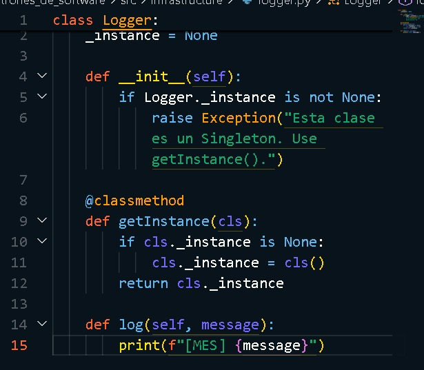

La implementación corresponde a una inicialización **Lazy**, ya que la instancia se crea solamente cuando se solicita por primera vez mediante `getInstance()`.

---

## 13.3 Interpretación dentro del MES

El patrón Singleton se utiliza para implementar un Logger centralizado.

Los componentes de producción y equipos pueden acceder al mismo Logger para registrar eventos del sistema.

La implementación permite evidenciar:

* **Una única instancia:** el sistema mantiene un solo objeto `Logger`.
* **Acceso global:** diferentes componentes pueden obtenerlo mediante `getInstance()`.
* **Estado consistente:** todos los componentes utilizan la misma instancia para registrar eventos.

---

## 13.4 Uso del Singleton

Desde el programa principal se solicita la instancia del Logger mediante `getInstance()`.

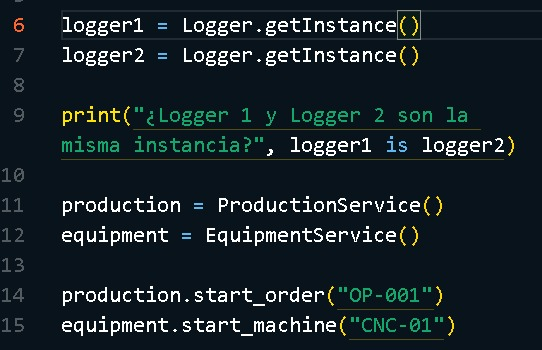

La variable `logger1` y la variable `logger2` obtienen la instancia mediante el mismo método.

Esto permite comprobar que ambas referencias corresponden al mismo objeto.

---

## 13.5 Prueba de ejecución

Se realizó una prueba solicitando dos veces la instancia del Logger y verificando si ambas referencias corresponden al mismo objeto.

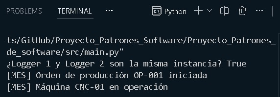

El resultado `True` demuestra que `logger1` y `logger2` corresponden a la misma instancia.

Además, se comprobó su utilización desde diferentes componentes del MES, registrando eventos relacionados con una orden de producción y una máquina CNC.

---
## 13.6 Evidencia de video

Los videos correspondientes a las evidencias de las implementaciones realizadas durante el proyecto se encuentran almacenados dentro del repositorio, en la siguiente ruta:

docs/videos/

---
## 13.7 Diagrama UML

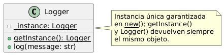

Código PlantUML utilizado para generar el diagrama (planttext.com):

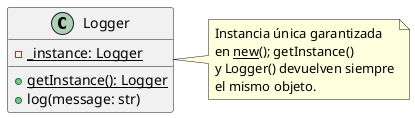
```plantuml
@startuml
class Logger {
  -{static} _instance: Logger
  +{static} getInstance(): Logger
  +log(message: str)
}

note right of Logger
  Instancia única garantizada
  en __new__(); getInstance()
  y Logger() devuelven siempre
  el mismo objeto.
end note

@enduml
```

---


## 13.8 Integración con los componentes del MES

La implementación del Singleton se relacionó con los componentes desarrollados para representar el proceso productivo.

Desde `main.py` se utilizan servicios relacionados con:

* Producción.
* Equipos.
* Registro de eventos.

Se trabaja con una orden de producción identificada como `OP-001` y una máquina CNC identificada como `CNC-01`.

Esto permite demostrar que el patrón no se implementa de forma aislada, sino como parte de la estructura del Sistema de Control de Producción.

---

## 13.9 Corrección posterior

Se identificó que la garantía de instancia única no estaba completamente asegurada: el control se realizaba en `__init__`, por lo que instanciar `Logger()` directamente (sin pasar por `getInstance()`) podía generar una segunda instancia.

Se corrigió trasladando el control a `__new__`, de forma que tanto `Logger()` como `getInstance()` devuelven siempre el mismo objeto. Se agregó una prueba automatizada que valida esta garantía.

---

# 14. Aplicación del patrón Factory Method

## 14.1 Objetivo

Aplicar el patrón de diseño Factory Method dentro del Sistema de Control de Producción (MES) para la creación de distintos tipos de orden de producción (`StandardOrder`, `UrgentOrder`), y validar que el patrón resuelve un problema real de diseño en el sistema, no solo que reproduce su estructura.

---

## 14.2 Problema identificado

El MES necesita crear diferentes tipos de orden de producción con prioridades distintas.

Inicialmente se exploró una solución basada en condicionales (`if`/`elif`) para decidir qué tipo de orden crear, lo cual obliga a modificar la lógica de creación cada vez que se agrega un nuevo tipo de orden, por ejemplo una futura `RushOrder`.

Esta situación genera un mayor acoplamiento y dificulta la aplicación del principio de abierto/cerrado (OCP).

Al revisar la primera implementación del patrón, se identificó un problema adicional: aunque la estructura de Factory Method estaba correctamente aplicada, `StandardOrder` y `UrgentOrder` no tenían ningún comportamiento distinto entre sí.

El atributo `priority` existía, pero ningún componente del sistema lo utilizaba.

En ese estado, el patrón tenía la forma correcta, pero no cumplía una función real dentro del sistema.

---

# 15. Implementación

## 15.1 Creator y ConcreteCreators

Se definió `OrderCreator` como clase abstracta con el método `create_order()`, y dos creadores concretos:

* `StandardOrderCreator`
* `UrgentOrderCreator`

Cada uno es responsable de instanciar su respectivo tipo de orden.

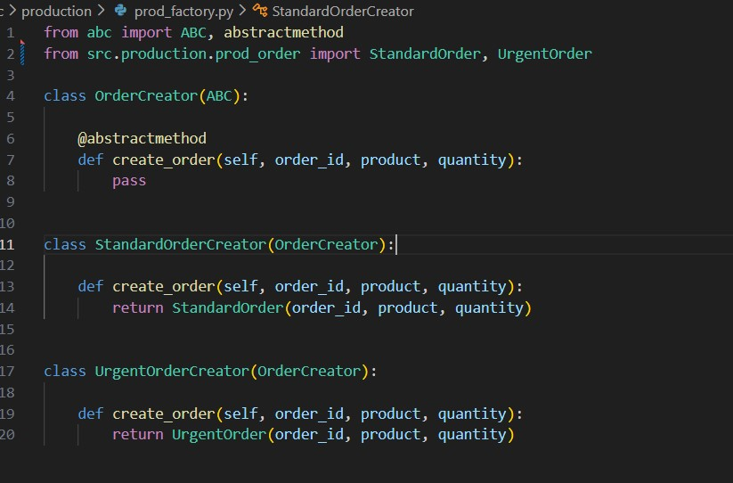

---

## 15.2 Comportamiento diferenciado en los productos

Para que el patrón resolviera un problema real, se agregó a `ProductionOrder` el método `get_priority_score()`.

Este método lanza `NotImplementedError` en la clase base, obligando a cada subclase concreta a definir su propio valor.

Los valores implementados son:

```text
StandardOrder → 1
UrgentOrder   → 10
```

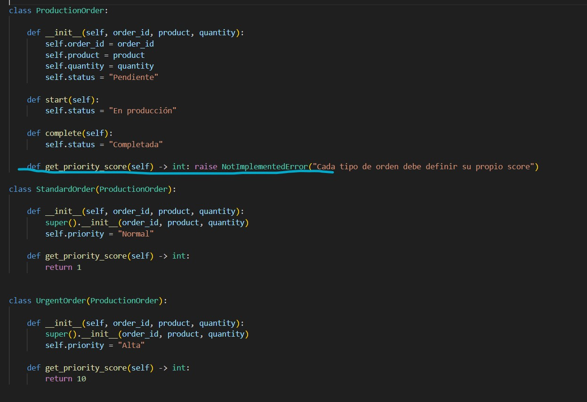

De esta manera, cada tipo de orden tiene un comportamiento específico que posteriormente puede ser utilizado por el sistema.

---

# 16. Interpretación dentro del MES

La estructura del patrón dentro del sistema se interpreta de la siguiente manera:

* **Producto (`Product`):** `StandardOrder` y `UrgentOrder`, con comportamiento propio a través de `get_priority_score()`.

* **Creador (`Creator`):** `OrderCreator`, con sus concretos `StandardOrderCreator` y `UrgentOrderCreator`.

* **Cliente:** `main.py`, que ya no instancia las órdenes directamente, sino a través de los creadores concretos.

Con esta estructura, agregar un nuevo tipo de orden, por ejemplo `RushOrder`, implicaría únicamente crear una nueva clase de producto y un nuevo creador concreto, sin modificar `ProductionService` ni el resto del sistema.

Esto permite aplicar el principio de abierto/cerrado y mantener separada la lógica de creación de las órdenes.

---

# 17. Uso del patrón

Desde `main.py` se instancian `StandardOrderCreator` y `UrgentOrderCreator`, y se utiliza `create_order()` para generar las órdenes de producción que luego se registran en `ProductionService`.

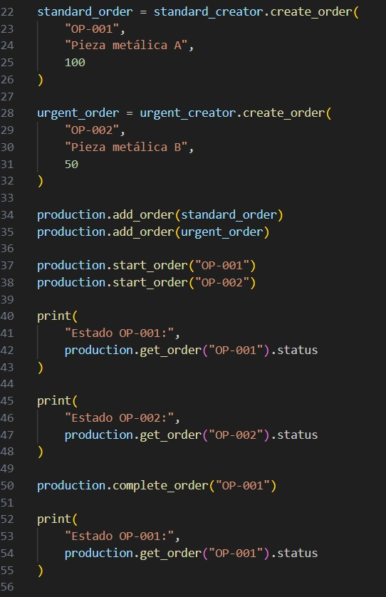

La creación de las órdenes queda de esta manera separada de la lógica principal del servicio de producción.

---

# 18. Consumo del comportamiento diferenciado

Se agregó el método `get_pending_queue()` en `ProductionService`.

Este método filtra las órdenes que se encuentran en estado:

```text
Pendiente
```

Posteriormente las ordena según `get_priority_score()`, de forma descendente.

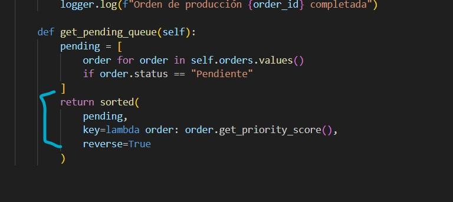

La ordenación se resuelve completamente mediante polimorfismo, sin utilizar `if`/`elif` ni `isinstance` para distinguir el tipo de orden.

De esta manera, el comportamiento definido en cada tipo concreto de orden tiene un efecto real sobre el funcionamiento del sistema.

---

# 19. Prueba de ejecución

Se ejecutó `main.py` para verificar el flujo completo:

1. Creación de órdenes mediante los creadores concretos.
2. Registro de las órdenes.
3. Inicio de las órdenes.
4. Finalización de las órdenes.

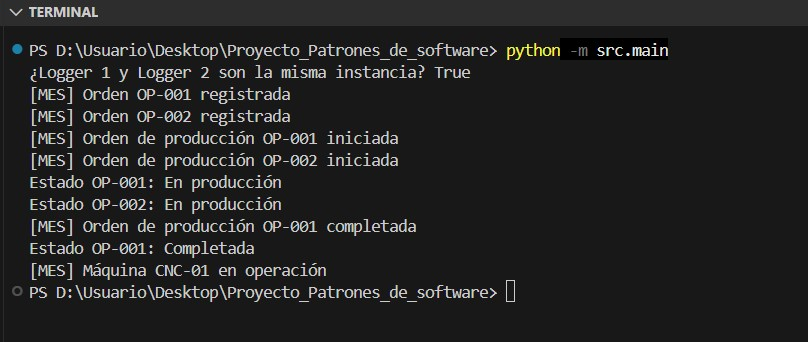

---

## 19.1 Pruebas automatizadas

Adicionalmente, se implementaron pruebas automatizadas con `pytest` para validar que el comportamiento diferenciado funciona correctamente.

Las pruebas verifican:

* Que `UrgentOrder` obtiene un score mayor que `StandardOrder`.
* Que `get_pending_queue()` prioriza correctamente las órdenes urgentes.
* Que se excluyen las órdenes que ya no están en estado `"Pendiente"`.

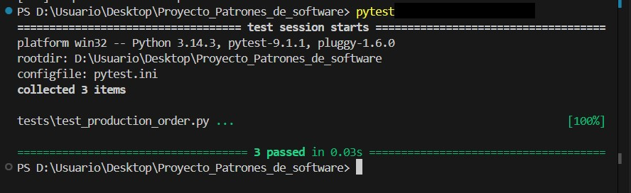

El resultado obtenido fue de **3 pruebas superadas**.

---


## 19.2 Evidencia de video

Los videos correspondientes a las evidencias de las implementaciones realizadas durante el proyecto se encuentran almacenados dentro del repositorio, en la siguiente ruta:

docs/videos/

---
## 19.3 Diagrama UML

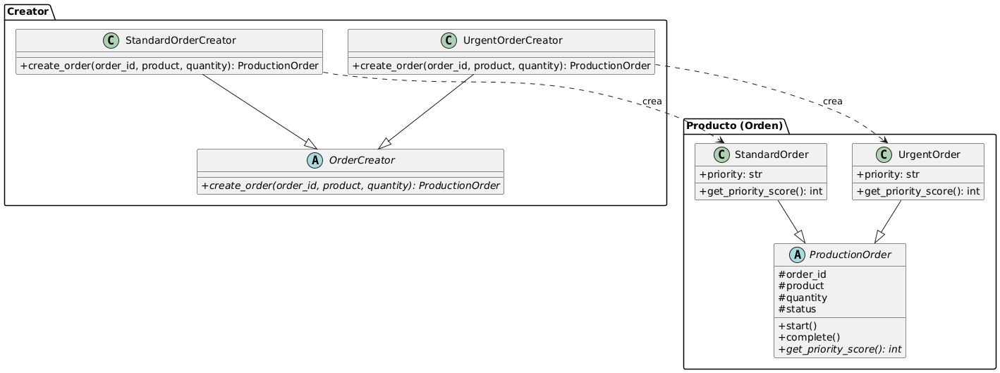

Código PlantUML utilizado para generar el diagrama (planttext.com):

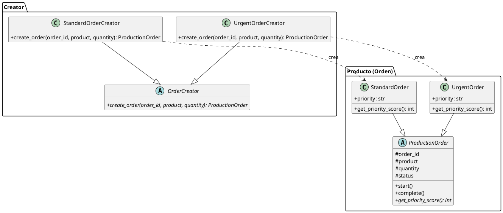
```plantuml
@startuml
skinparam classAttributeIconSize 0

package "Producto (Orden)" {
  abstract class ProductionOrder {
    #order_id
    #product
    #quantity
    #status
    +start()
    +complete()
    +{abstract} get_priority_score(): int
  }
  class StandardOrder {
    +priority: str
    +get_priority_score(): int
  }
  class UrgentOrder {
    +priority: str
    +get_priority_score(): int
  }
  StandardOrder --|> ProductionOrder
  UrgentOrder --|> ProductionOrder
}

package "Creator" {
  abstract class OrderCreator {
    +{abstract} create_order(order_id, product, quantity): ProductionOrder
  }
  class StandardOrderCreator {
    +create_order(order_id, product, quantity): ProductionOrder
  }
  class UrgentOrderCreator {
    +create_order(order_id, product, quantity): ProductionOrder
  }
  StandardOrderCreator --|> OrderCreator
  UrgentOrderCreator --|> OrderCreator
}

StandardOrderCreator ..> StandardOrder : crea
UrgentOrderCreator ..> UrgentOrder : crea

@enduml
```

---

# 20. Aplicación del patrón Abstract Factory

## 20.1 Objetivo

Aplicar el patrón Abstract Factory para la creación de familias de equipos de producción (línea CNC y línea robótica) del MES, garantizando que los componentes de una misma familia (equipo + inspección) se creen siempre de forma consistente, sin mezclarse con los de otra familia.

---

## 20.2 Problema identificado

El sistema necesita representar distintas tecnologías de producción (por ejemplo, celdas CNC y celdas robóticas), cada una compuesta por un equipo y un tipo de inspección asociado que deben ser coherentes entre sí (una máquina CNC no debe combinarse con una inspección pensada para ensamble robótico).

Aplicar nuevamente Factory Method sobre este problema no resolvería la necesidad real, ya que ese patrón crea un único producto a la vez; aquí se requiere crear **familias completas de productos relacionados** desde un mismo punto de creación.

Antes de esta implementación, `EquipmentService` no representaba ningún equipo real: `start_machine()` solo registraba un mensaje a partir de un identificador de texto, sin ningún objeto de dominio detrás.

---

## 20.3 Implementación

### 20.3.1 Productos abstractos

Se definieron dos interfaces base: `Equipment` (con `start()`, `stop()` y estado) e `Inspection` (con `inspect()`).

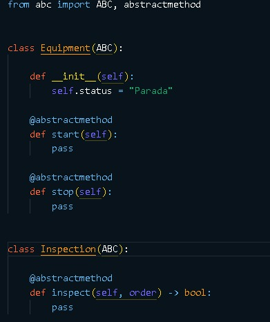

### 20.3.2 Productos concretos y fábricas concretas

Se implementaron dos familias:

* **Línea CNC:** `CNCMachine` + `CNCInspection`.
* **Línea robótica:** `RobotArm` + `RobotInspection`.

Cada familia se agrupa mediante una fábrica concreta que hereda de `AbstractProductionCellFactory`:

* `CNCCellFactory` → crea `CNCMachine` + `CNCInspection`.
* `RobotCellFactory` → crea `RobotArm` + `RobotInspection`.

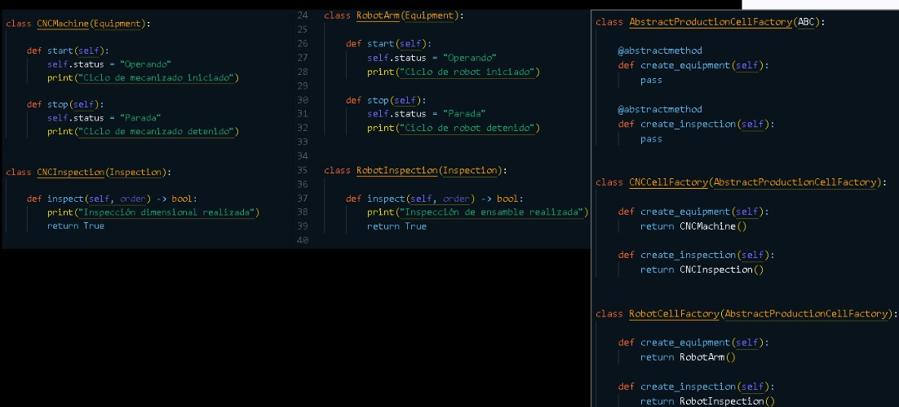

---

## 20.4 Interpretación dentro del MES

* **Productos abstractos:** `Equipment`, `Inspection`.
* **Productos concretos:** `CNCMachine`/`CNCInspection` (familia CNC), `RobotArm`/`RobotInspection` (familia robótica).
* **Fábrica abstracta:** `AbstractProductionCellFactory`.
* **Fábricas concretas:** `CNCCellFactory`, `RobotCellFactory`.
* **Cliente:** `EquipmentService`, que recibe una única fábrica en su constructor y crea a partir de ella tanto el equipo como la inspección, garantizando que ambos pertenezcan a la misma familia.

Agregar una nueva línea de producción en el futuro implicaría únicamente crear sus productos concretos y su fábrica concreta, sin modificar `EquipmentService`.

---

## 20.5 Uso del patrón

`EquipmentService` recibe la fábrica en su constructor y delega en ella la creación del equipo y la inspección. También se actualizó para registrar sus eventos a través del `Logger` centralizado, en lugar de mensajes de consola independientes.

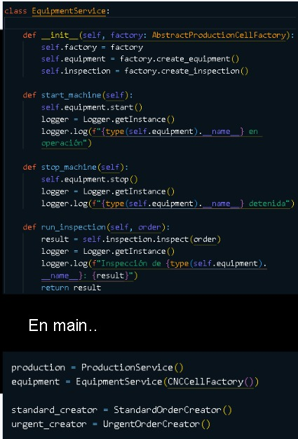

---

## 20.6 Prueba de ejecución

Se ejecutó `main.py` utilizando `CNCCellFactory`, verificando que el equipo y la inspección creados correspondan a la misma familia y que los eventos se registren mediante el Logger.

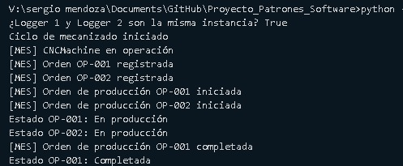

### 20.6.1 Pruebas automatizadas

Se implementaron pruebas que verifican:

* Que cada fábrica concreta crea los productos correspondientes a su propia familia.
* Que ninguna fábrica combina productos de familias distintas (por ejemplo, un `CNCMachine` con una `RobotInspection`).
* Que `EquipmentService` refleja correctamente la familia de la fábrica recibida.
* Que `start_machine()`/`stop_machine()` cambian correctamente el estado del equipo.

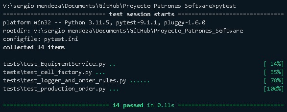

El resultado obtenido fue de **14 pruebas superadas** en total sobre el proyecto.

---

## 20.7 Evidencia de video

Los videos correspondientes a las evidencias de las implementaciones realizadas durante el proyecto se encuentran almacenados dentro del repositorio, en la siguiente ruta:

docs/videos/
---

## 20.8 Diagrama UML

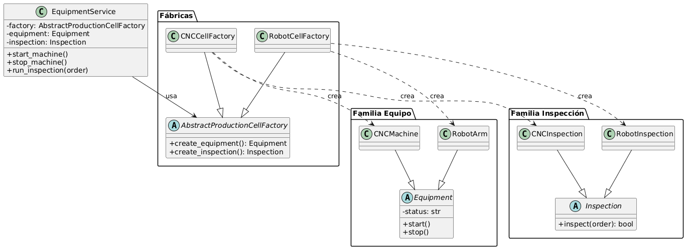

Código PlantUML utilizado para generar el diagrama (planttext.com):

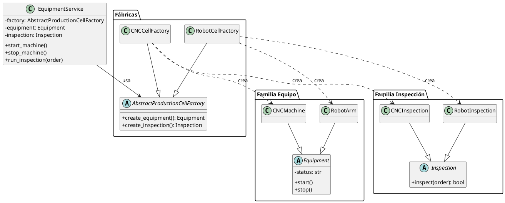
```plantuml
@startuml
skinparam classAttributeIconSize 0

package "Familia Equipo" {
  abstract class Equipment {
    -status: str
    +start()
    +stop()
  }
  class CNCMachine
  class RobotArm
  CNCMachine --|> Equipment
  RobotArm --|> Equipment
}

package "Familia Inspección" {
  abstract class Inspection {
    +inspect(order): bool
  }
  class CNCInspection
  class RobotInspection
  CNCInspection --|> Inspection
  RobotInspection --|> Inspection
}

package "Fábricas" {
  abstract class AbstractProductionCellFactory {
    +create_equipment(): Equipment
    +create_inspection(): Inspection
  }
  class CNCCellFactory
  class RobotCellFactory
  CNCCellFactory --|> AbstractProductionCellFactory
  RobotCellFactory --|> AbstractProductionCellFactory
}

class EquipmentService {
  -factory: AbstractProductionCellFactory
  -equipment: Equipment
  -inspection: Inspection
  +start_machine()
  +stop_machine()
  +run_inspection(order)
}

EquipmentService --> AbstractProductionCellFactory : usa
CNCCellFactory ..> CNCMachine : crea
CNCCellFactory ..> CNCInspection : crea
RobotCellFactory ..> RobotArm : crea
RobotCellFactory ..> RobotInspection : crea
@enduml
```


---
# 21. Aplicación del patrón Builder

## 21.1 Objetivo

Aplicar el patrón Builder para la construcción de órdenes de producción con datos opcionales (lote, fechas, descripción, equipo asignado), evitando un constructor con demasiados parámetros y permitiendo configurar solo lo que cada orden necesita.

---

## 21.2 Problema identificado

Al robustecer el dominio del MES, `ProductionOrder` pasó de tener 3 parámetros obligatorios a incorporar 5 datos adicionales opcionales (lote, fecha de ingreso, fecha de entrega, descripción, equipo asignado). Construir una orden directamente con el constructor, indicando todos estos valores en orden, se vuelve difícil de leer y propenso a errores, especialmente cuando la mayoría de los datos son opcionales.

Se descartó incorporar la decisión del tipo de orden (Standard/Urgent) dentro del propio Builder, ya que esa responsabilidad ya la resuelve el patrón Factory Method implementado previamente; hacerlo hubiera duplicado la misma decisión en dos patrones distintos.

---

## 21.3 Implementación

Se implementó `OrderBuilder` como builder fluido (fluent builder): cada método `with_*()` configura un dato opcional y retorna la misma instancia (`self`), permitiendo encadenar llamadas. El método `build()` no decide el tipo de orden: únicamente arma y retorna los datos necesarios.

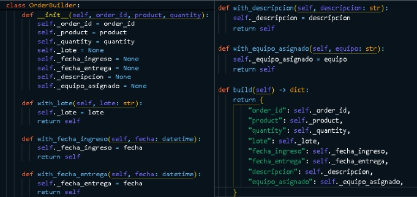

La creación del tipo de orden concreto sigue a cargo del Factory Method existente: `StandardOrderCreator`/`UrgentOrderCreator` reciben los datos ya construidos por el Builder y crean la orden correspondiente.

---

## 21.4 Interpretación dentro del MES

* **Builder:** `OrderBuilder`, con sus métodos `with_lote()`, `with_fecha_ingreso()`, `with_fecha_entrega()`, `with_descripcion()`, `with_equipo_asignado()` y `build()`.
* **Producto del Builder:** un diccionario con los datos de la orden (no la orden en sí).
* **Consumidor del producto:** `StandardOrderCreator`/`UrgentOrderCreator` (Factory Method), que reciben ese diccionario para construir la orden concreta.

Esta división mantiene una responsabilidad única por patrón: el Builder arma los datos; el Factory Method decide y construye el tipo concreto.

---

## 21.5 Uso del patrón

Desde `main.py` se utiliza `OrderBuilder` de forma encadenada para construir los datos de una orden urgente con información adicional, y de forma mínima para una orden estándar que solo requiere los datos obligatorios. También se amplió la ejecución para mostrar en consola los datos construidos y la cola de órdenes pendientes (`get_pending_queue()`), evidenciando la integración entre Builder, Factory Method y la cola de producción.

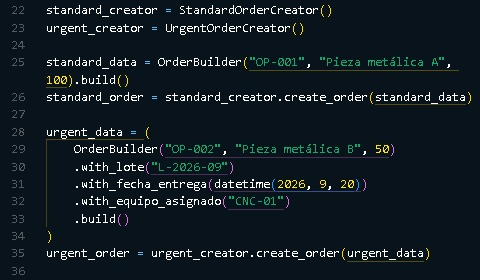

---

## 21.6 Prueba de ejecución

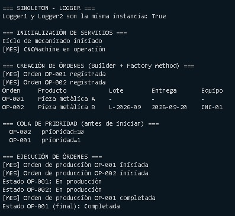

### 21.6.1 Pruebas automatizadas

Se implementaron pruebas que verifican que el Builder produce correctamente los datos con solo los campos obligatorios, y que un `Creator` concreto construye la orden final utilizando los datos configurados mediante el Builder.

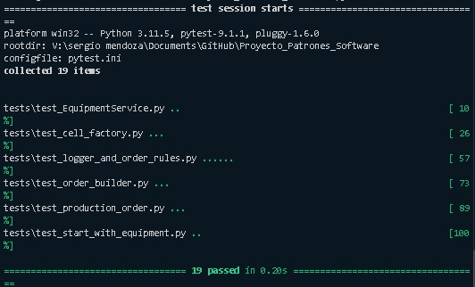

---

## 21.7 Diagrama UML

*(Incluye únicamente las clases que participan en este patrón: `OrderBuilder`, `ProductionOrder` y los creadores concretos que consumen sus datos.)*

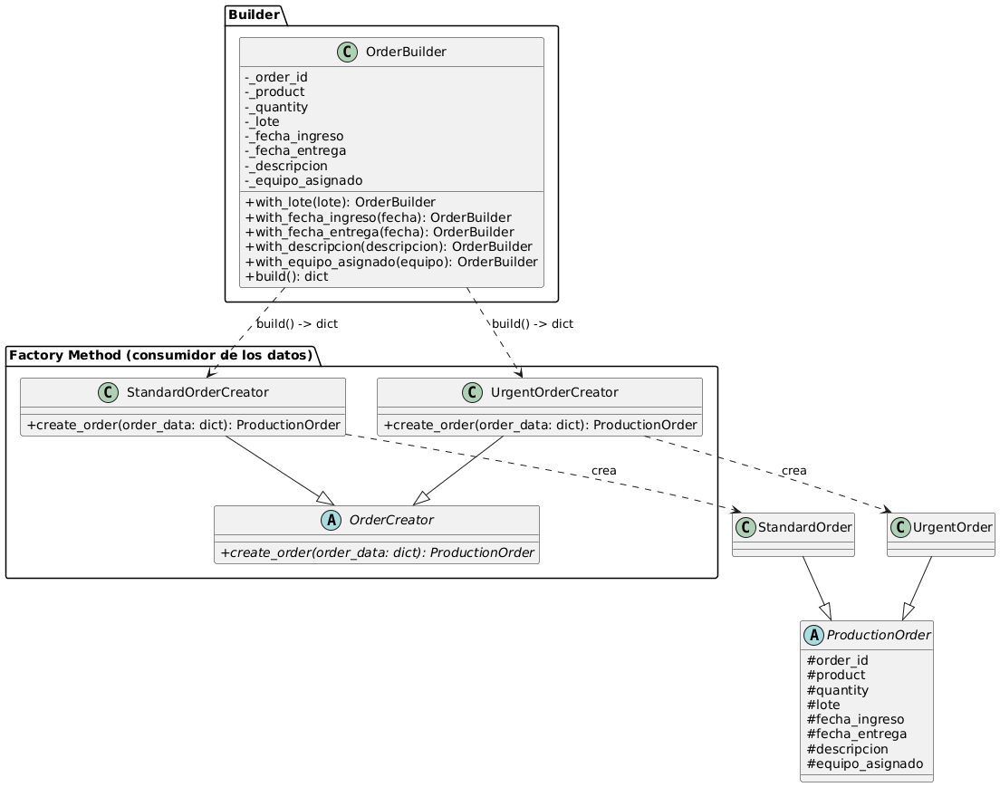

Código PlantUML utilizado para generar el diagrama (planttext.com):

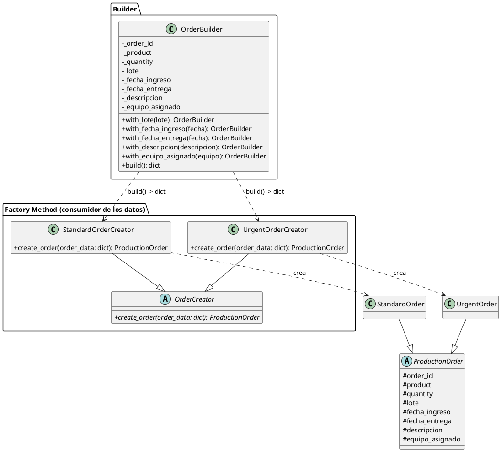
```plantuml
@startuml
skinparam classAttributeIconSize 0

package "Builder" {
  class OrderBuilder {
    -_order_id
    -_product
    -_quantity
    -_lote
    -_fecha_ingreso
    -_fecha_entrega
    -_descripcion
    -_equipo_asignado
    +with_lote(lote): OrderBuilder
    +with_fecha_ingreso(fecha): OrderBuilder
    +with_fecha_entrega(fecha): OrderBuilder
    +with_descripcion(descripcion): OrderBuilder
    +with_equipo_asignado(equipo): OrderBuilder
    +build(): dict
  }
}

package "Factory Method (consumidor de los datos)" {
  abstract class OrderCreator {
    +{abstract} create_order(order_data: dict): ProductionOrder
  }
  class StandardOrderCreator {
    +create_order(order_data: dict): ProductionOrder
  }
  class UrgentOrderCreator {
    +create_order(order_data: dict): ProductionOrder
  }
  StandardOrderCreator --|> OrderCreator
  UrgentOrderCreator --|> OrderCreator
}

abstract class ProductionOrder {
  #order_id
  #product
  #quantity
  #lote
  #fecha_ingreso
  #fecha_entrega
  #descripcion
  #equipo_asignado
}
class StandardOrder
class UrgentOrder
StandardOrder --|> ProductionOrder
UrgentOrder --|> ProductionOrder

OrderBuilder ..> StandardOrderCreator : build() -> dict
OrderBuilder ..> UrgentOrderCreator : build() -> dict
StandardOrderCreator ..> StandardOrder : crea
UrgentOrderCreator ..> UrgentOrder : crea

@enduml
```


---

# 22. Aplicación del patrón Prototype

## 22.1 Objetivo

Aplicar el patrón Prototype para clonar órdenes de producción que pertenecen a un mismo lote, evitando repetir la configuración completa (lote, fecha de entrega, equipo asignado) cada vez que se crea una orden similar dentro del mismo lote.

---

## 22.2 Problema identificado

El campo `lote`, incorporado junto con el patrón Builder, no tenía hasta ahora ningún uso real dentro del sistema. En un entorno de producción, es común que un mismo lote se fabrique en varias tandas (varias órdenes con el mismo producto, fecha de entrega y equipo asignado, pero con cantidades distintas).

Construir cada orden de una tanda repitiendo toda la cadena de `OrderBuilder` es innecesario cuando la mayoría de los datos ya están definidos por una orden plantilla del mismo lote. Se requiere una forma de reutilizar esa configuración ya construida, generando copias independientes con solo los datos que cambian entre tandas (`order_id` y `quantity`).

---

## 22.3 Implementación

Se agregó el método `clone(new_order_id, new_quantity=None)` en `ProductionOrder`, heredado sin modificaciones por `StandardOrder` y `UrgentOrder`. Utiliza `copy.deepcopy()` para generar una copia completamente independiente de la orden original, y fuerza explícitamente el `status` de la copia a `"Pendiente"`, sin importar el estado en que se encuentre la orden original.

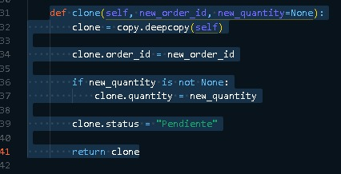

---

## 22.4 Interpretación dentro del MES

* **Prototipo:** `ProductionOrder`, con el método `clone()` que heredan `StandardOrder` y `UrgentOrder`.
* **Cliente:** `main.py`, que construye una orden plantilla (mediante `OrderBuilder` + Factory Method) y genera copias de esa plantilla para representar distintas tandas del mismo lote.

A diferencia de Abstract Factory (que crea familias completas desde cero) y de Builder (que arma los datos paso a paso), Prototype reutiliza un objeto ya construido, cambiando únicamente lo que distingue a cada copia.

---

## 22.5 Uso del patrón

Desde `main.py` se crea una orden plantilla del lote mediante `OrderBuilder` y `UrgentOrderCreator`, y se generan dos copias adicionales mediante `clone()`, representando tandas distintas del mismo lote con cantidades diferentes.

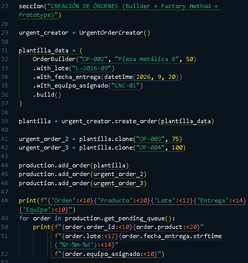

---

## 22.6 Prueba de ejecución

Se ejecutó `main.py`, registrando las tres órdenes del lote (la plantilla y sus dos clones) en `ProductionService`, y mostrando la cola de prioridad con las tres órdenes.

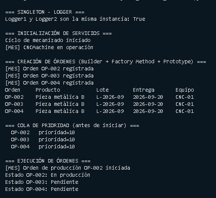

### 22.6.1 Pruebas automatizadas

Se implementaron pruebas que verifican que la orden clonada es una instancia distinta de la original, que conserva `lote`, `fecha_entrega` y `equipo_asignado`, que recibe un nuevo `order_id` y una nueva `quantity`, y que su estado es `"Pendiente"` incluso si la orden original ya se encuentra `"Completada"`.

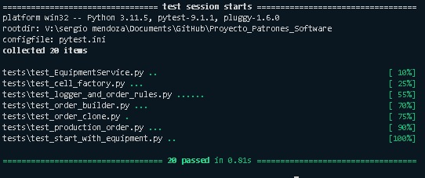

El resultado obtenido fue de **20 pruebas superadas** en total sobre el proyecto.

---

## 22.7 Diagrama UML

*(Incluye únicamente las clases que participan en este patrón: `ProductionOrder`, con el método `clone()`, y sus subclases `StandardOrder`/`UrgentOrder`, que lo heredan sin modificarlo.)*

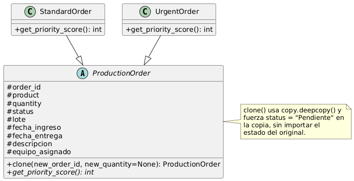

Código PlantUML utilizado para generar el diagrama (planttext.com):

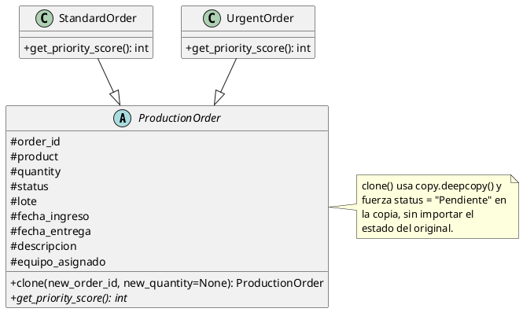
```plantuml
@startuml
skinparam classAttributeIconSize 0

abstract class ProductionOrder {
  #order_id
  #product
  #quantity
  #status
  #lote
  #fecha_ingreso
  #fecha_entrega
  #descripcion
  #equipo_asignado
  +clone(new_order_id, new_quantity=None): ProductionOrder
  +{abstract} get_priority_score(): int
}

class StandardOrder {
  +get_priority_score(): int
}

class UrgentOrder {
  +get_priority_score(): int
}

StandardOrder --|> ProductionOrder
UrgentOrder --|> ProductionOrder

note right of ProductionOrder
  clone() usa copy.deepcopy() y
  fuerza status = "Pendiente" en
  la copia, sin importar el
  estado del original.
end note
@enduml
```

---

# Aplicación del patrón Adapter

## Objetivo

Integrar el módulo estándar `logging` de Python al Logger centralizado del MES, agregando niveles de severidad y persistencia en archivo, sin modificar la interfaz que ya usa el resto del sistema (`Logger.getInstance().log(mensaje)`).

---

## Problema identificado

El `Logger` centralizado, implementado mediante Singleton, únicamente escribía mensajes por consola (`print`), sin niveles de severidad, sin historial ni persistencia en archivo — una limitación ya identificada en revisiones anteriores del proyecto.

La librería estándar `logging` de Python resuelve esta necesidad, pero expone una interfaz distinta (`.info()`, `.warning()`, `.error()`, configuración de *handlers*) a la que ya usa el resto del sistema (`.log(mensaje)`). Modificar directamente todos los puntos del código que ya invocan `Logger.getInstance().log(...)` para adaptarse a `logging` habría significado un cambio invasivo e innecesario.

---

## Implementación

Se implementó `StandardLoggingAdapter`, que traduce las llamadas `write(mensaje, nivel)` hacia el método correspondiente de `logging` (`.info()`, `.warning()`, `.error()`), configurando además un `StreamHandler` (consola) y un `FileHandler` (archivo) con formato de fecha, nivel y mensaje.

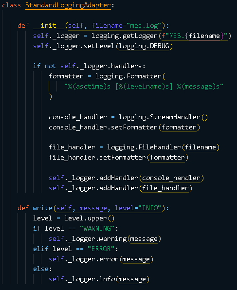

`Logger` (Singleton) crea una única instancia del adapter al momento de crear su propia instancia (dentro de `__new__`), y delega en él toda la escritura de eventos. El resto del sistema no sufre ningún cambio: sigue llamando `Logger.getInstance().log(mensaje)` exactamente igual que antes.

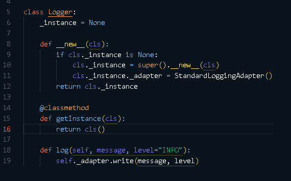

---

## Interpretación dentro del MES

* **Client/Target:** `Logger`, con su interfaz existente `.log(mensaje, nivel)`.
* **Adapter:** `StandardLoggingAdapter`.
* **Adaptee:** el módulo `logging` de Python, con su propia interfaz incompatible.

Ningún componente del sistema que ya usaba `Logger` necesitó modificarse — la traducción de interfaz queda encapsulada completamente dentro del adapter.

---

## Uso y prueba de ejecución

Al ejecutar `main.py`, los eventos del sistema se registran simultáneamente en consola y en un archivo de log persistente, con nivel y timestamp.

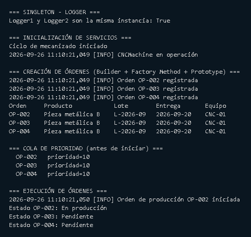

### Pruebas automatizadas

Se implementó una prueba que verifica que el adapter efectivamente crea el archivo de log y escribe el mensaje con su nivel correspondiente. Durante su desarrollo se detectó y corrigió un problema real: `logging.getLogger()` mantiene un registro global por nombre, lo que causaba que distintos archivos de log compartieran los mismos *handlers*; se resolvió aislando el logger interno por nombre de archivo.

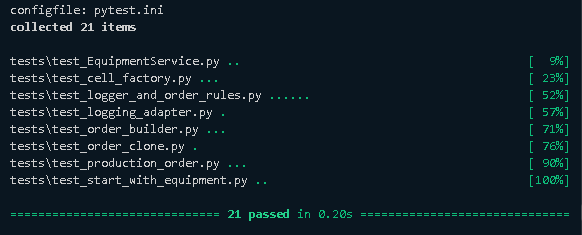

El resultado obtenido fue de **21 pruebas superadas** en total sobre el proyecto.

---

## Diagrama UML

*(Incluye únicamente las clases que participan en este patrón: `Logger`, `StandardLoggingAdapter`, y el módulo `logging` de Python como Adaptee.)*

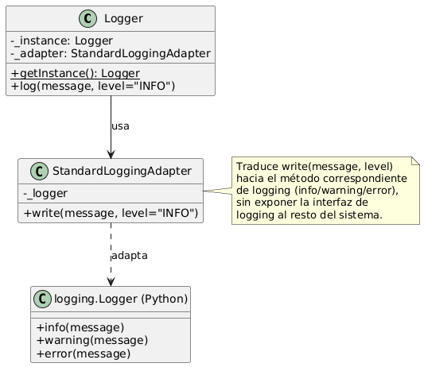

Código PlantUML utilizado (planttext.com):

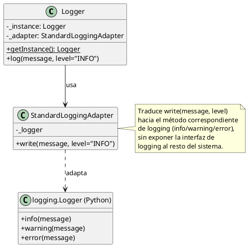
```plantuml
@startuml
skinparam classAttributeIconSize 0

class Logger {
  -_instance: Logger
  -_adapter: StandardLoggingAdapter
  +{static} getInstance(): Logger
  +log(message, level="INFO")
}

class StandardLoggingAdapter {
  -_logger
  +write(message, level="INFO")
}

class "logging.Logger (Python)" as PyLogging {
  +info(message)
  +warning(message)
  +error(message)
}

Logger --> StandardLoggingAdapter : usa
StandardLoggingAdapter ..> PyLogging : adapta

note right of StandardLoggingAdapter
  Traduce write(message, level)
  hacia el método correspondiente
  de logging (info/warning/error),
  sin exponer la interfaz de
  logging al resto del sistema.
end note
@enduml
```

---

# Evaluación del patrón Bridge (no implementado en esta etapa)

## Análisis realizado

Bridge busca separar una abstracción de su implementación cuando existen **dos dimensiones independientes que varían por separado**, evitando una explosión combinatoria de subclases.

Se revisó el proyecto buscando específicamente esa condición:

* Las familias de equipo (línea CNC / línea robótica) ya están resueltas mediante Abstract Factory, y no presentan una segunda dimensión de variación adicional (por ejemplo, un modo de operación o un tipo de control que varíe independientemente de la línea).
* No existe actualmente ningún otro par de dimensiones del dominio (dos aspectos que deban evolucionar por separado) que justifique la separación abstracción/implementación propia de Bridge.

## Justificación de no aplicarlo

Aplicar Bridge sin una segunda dimensión real habría significado introducir complejidad adicional sin resolver ningún problema concreto del sistema — contrario a la metodología seguida durante todo el proyecto, donde cada patrón se incorpora únicamente ante una necesidad identificada.

Se documenta esta decisión como parte del análisis crítico del segundo corte. Si en etapas posteriores (por ejemplo, al desarrollar Composite o Decorator) surge una necesidad real de este tipo, se evaluará nuevamente.


# Aplicación del patrón Composite

## Objetivo

Permitir que el MES trate de la misma forma una orden de producción individual y un **grupo de órdenes** (por ejemplo, un lote completo), de modo que operaciones como iniciar, completar, consultar la cantidad o calcular la prioridad se apliquen a todo el grupo sin que el código cliente tenga que recorrerlo manualmente.

---

## Contextualización y problema identificado

En `main.py` se crean tres órdenes que pertenecen al mismo lote (`L-2026-09`): una plantilla (`OP-002`) y dos clones generados con Prototype (`OP-003` y `OP-004`). Sin embargo, el sistema no tiene ningún concepto de lote como estructura: el lote es únicamente un texto (`lote: str`) guardado en cada orden.

Esto se evidencia en la ejecución original: al llamar a `start_order_with_equipment("OP-002", equipment)` solo cambia el estado de `OP-002`; `OP-003` y `OP-004`, que son del mismo lote, siguen en `Pendiente`. Para iniciar el lote completo habría que repetir la llamada orden por orden.

## Necesidad

* Representar un lote (y eventualmente sublotes) como un objeto del dominio.
* Iniciar o completar un lote con una sola operación.
* Obtener la cantidad total y la prioridad de un lote sin recorrerlo desde fuera.
* Hacerlo sin modificar `ProductionService`, que ya trabaja con `ProductionOrder`.

## Alternativas consideradas

| Alternativa | Por qué se descartó |
| ----------- | ------------------- |
| Agregar un método `start_lote()` a `ProductionService` que busque las órdenes por el texto del lote | Mezcla lógica de agrupación dentro del servicio, no permite sublotes y obliga a buscar por texto. |
| Crear una clase `Lote` independiente, sin relación con `ProductionOrder` | `ProductionService` tendría que distinguir con `isinstance` entre órdenes y lotes en cada operación. |
| **Composite: un grupo que también es una `ProductionOrder`** | Mantiene una sola interfaz; el servicio no cambia; permite grupos dentro de grupos. **Seleccionada.** |

---

## Patrón aplicado

Composite compone objetos en estructuras de árbol (parte-todo) y permite tratar objetos individuales y composiciones mediante la misma interfaz.

### Interpretación dentro del MES

* **Component:** `ProductionOrder`, con `start()`, `complete()`, `get_priority_score()`, `clone()`, `quantity` y `status`.
* **Leaf:** `StandardOrder` y `UrgentOrder`.
* **Composite:** `OrderGroup`, que contiene hijos (órdenes u otros grupos).
* **Client:** `ProductionService` y `main.py`, que trabajan con `ProductionOrder` sin saber si es una orden o un grupo.

---

## Implementación

El patrón se implementó en un archivo nuevo:

`src/production/order_group.py`

Las clases existentes (`ProductionOrder`, `StandardOrder`, `UrgentOrder`, `ProductionService`) **no se modificaron**.

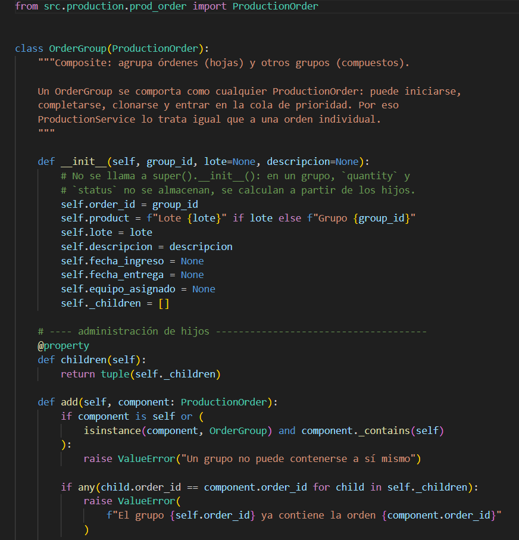

`OrderGroup` hereda de `ProductionOrder` y reinterpreta cada operación sobre sus hijos:

| Operación | Comportamiento en `OrderGroup` |
| --------- | ------------------------------ |
| `quantity` | Suma de las cantidades de los hijos (propiedad calculada). |
| `status` | Se calcula: `Pendiente` si todos los hijos lo están, `Completada` si todos lo están, y `En producción` en cualquier otro caso. Un grupo vacío es `Pendiente`. |
| `start()` | Inicia solo los hijos que están `Pendiente`; nunca reinicia una orden ya iniciada o completada. |
| `complete()` | Completa solo los hijos que están `En producción`. |
| `get_priority_score()` | Máximo de los puntajes de sus hijos (0 si está vacío), de modo que un lote con una orden urgente se ordena como urgente en la cola. |
| `clone(new_id)` | Clona recursivamente cada hijo y los renombra con sufijo (`G-2-1`, `G-2-2`...) para no duplicar identificadores. No admite `new_quantity`, porque la cantidad del grupo depende de sus hijos. |
| `add()` / `remove()` | Administran los hijos. Rechazan duplicados por `order_id` y evitan ciclos (un grupo no puede contenerse a sí mismo ni a sus ancestros). |
| `count_orders()` | Cantidad de órdenes individuales en todo el árbol. |

### Decisiones de diseño

* **No se llama a `super().__init__()`:** en un grupo, `quantity` y `status` no se guardan sino que se calculan a partir de los hijos. Guardarlos permitiría que quedaran inconsistentes con las órdenes que contiene.
* **`add()` y `remove()` solo existen en `OrderGroup`:** se eligió el enfoque de Composite *seguro* (la gestión de hijos no se agrega a `ProductionOrder`), porque una orden individual no tiene hijos y exponer esos métodos en ella no tendría sentido.
* **Integración con Prototype:** `clone()` del grupo reutiliza el `clone()` de cada orden, por lo que se conserva la independencia de las copias y su reinicio a `Pendiente`.

### Integración con los demás patrones

* **Factory Method / Builder:** crean las órdenes que se agregan como hojas.
* **Prototype:** permite clonar un lote completo.
* **Singleton + Adapter:** `ProductionService` registra mediante `Logger` el inicio del grupo igual que el de cualquier orden.

---

## Uso y prueba de ejecución

```python
lote = OrderGroup("LOTE-01", lote="L-2026-09")
lote.add(plantilla.clone("OP-010", 20))
lote.add(plantilla.clone("OP-011", 30))

subgrupo = OrderGroup("LOTE-01-B", lote="L-2026-09")
subgrupo.add(StandardOrder("OP-012", "Pieza metálica C", 15))
lote.add(subgrupo)

production.add_order(lote)
production.start_order_with_equipment("LOTE-01", equipment)
```

Salida obtenida al ejecutar `main.py`:

```text
=== COMPOSITE - LOTE DE ÓRDENES ===
Órdenes individuales en el lote: 3
Cantidad total del lote: 65
Prioridad del lote (máxima de sus hijos): 10
Estado del lote: Pendiente
Estado del lote tras iniciarlo: En producción
  OP-010     estado=En producción
  OP-011     estado=En producción
  LOTE-01-B  estado=En producción
  OP-012 (dentro del subgrupo): En producción
```

Con una sola llamada a `start_order_with_equipment("LOTE-01", equipment)` cambian de estado las dos órdenes del lote y la orden del subgrupo anidado.


---

## Pruebas automatizadas

Archivo: `tests/test_order_group.py` (13 pruebas).

Se verificó que:

* La cantidad del grupo es la suma de las cantidades de sus hijos.
* La prioridad del grupo es la máxima de sus hijos; un grupo vacío tiene prioridad 0 y estado `Pendiente`.
* `start()` y `complete()` se propagan a los hijos.
* `start()` no reinicia hijos ya completados.
* El estado del grupo es `En producción` cuando los hijos tienen estados distintos.
* Los grupos anidados agregan de forma recursiva.
* Un grupo no puede contenerse a sí mismo ni a su ancestro, y rechaza `order_id` duplicados.
* `remove()` elimina un hijo y rechaza uno que no pertenece al grupo.
* `clone()` crea una copia independiente con los hijos renombrados y estado `Pendiente`, y rechaza `new_quantity`.
* `ProductionService` trata al grupo como una orden individual: lo ordena en la cola, lo inicia con validación de equipo y lo completa.

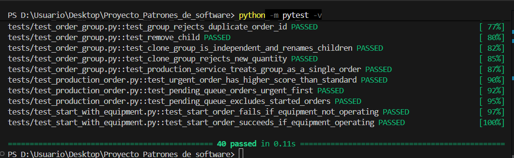

Resultado total del proyecto: **40 pruebas superadas**.

---

## Limitaciones

* Si una orden hija se inicia por separado, el grupo pasa a `En producción` aunque el resto siga pendiente; el estado del grupo refleja el avance de sus hijos, no una orden propia.
* Si la misma orden se registra en `ProductionService` y además dentro de un grupo, aparecerá dos veces en la cola de pendientes. En la demostración se registran en el servicio solo los grupos.
* El grupo no valida que todos sus hijos compartan el mismo equipo asignado.

## Aplicaciones evaluadas y no implementadas

* **Composite sobre equipos (`ProductionLine` que agrupe una CNC y un brazo robótico):** es viable técnicamente, pero el alcance actual no define líneas de producción y las fábricas de `Equipment` e `Inspection` modelan familias distintas, no una relación parte-todo. Se dejó fuera para no introducir una jerarquía sin una necesidad real.

---

## Diagrama UML

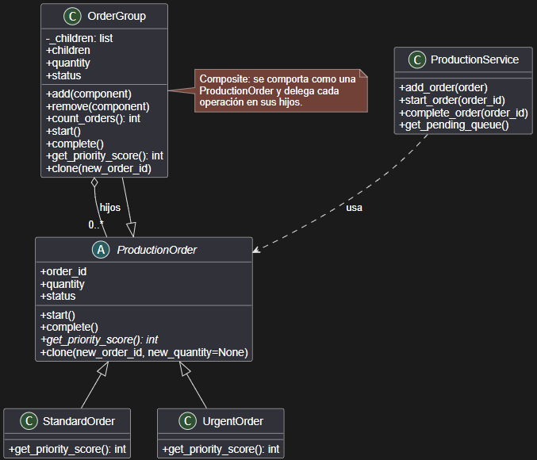

Código PlantUML utilizado (planttext.com):

@startuml
skinparam classAttributeIconSize 0

abstract class ProductionOrder {
  +order_id
  +quantity
  +status
  +start()
  +complete()
  +{abstract} get_priority_score(): int
  +clone(new_order_id, new_quantity=None)
}

class StandardOrder {
  +get_priority_score(): int
}

class UrgentOrder {
  +get_priority_score(): int
}

class OrderGroup {
  -_children: list
  +children
  +quantity
  +status
  +add(component)
  +remove(component)
  +count_orders(): int
  +start()
  +complete()
  +get_priority_score(): int
  +clone(new_order_id)
}

class ProductionService {
  +add_order(order)
  +start_order(order_id)
  +complete_order(order_id)
  +get_pending_queue()
}

ProductionOrder <|-- StandardOrder
ProductionOrder <|-- UrgentOrder
ProductionOrder <|-- OrderGroup
OrderGroup o-- "0..*" ProductionOrder : hijos
ProductionService ..> ProductionOrder : usa

note right of OrderGroup
  Composite: se comporta como una
  ProductionOrder y delega cada
  operación en sus hijos.
end note
@enduml


---

# Aplicación del patrón Decorator

## Objetivo

Agregar responsabilidades a las inspecciones de los equipos (registro detallado de eventos y medición de tiempo) de forma dinámica y combinable, sin modificar las inspecciones concretas ni `EquipmentService`.

---

## Contextualización y problema identificado

Cada equipo del MES tiene una inspección asociada, creada por la Abstract Factory (`CNCInspection`, `RobotInspection`), con una única operación: `inspect(order) -> bool`.

Hoy esas inspecciones solo imprimen un mensaje y devuelven un resultado. `EquipmentService.run_inspection()` registra una línea de resumen, pero no se registra el inicio de la inspección, no se distingue un rechazo con un nivel de severidad propio (`WARNING`) y no se mide cuánto tarda.

Agregar estas capacidades dentro de cada inspección tendría un problema: habría que repetir el mismo código en `CNCInspection` y en `RobotInspection`, y cualquier combinación (solo registro, solo tiempo, ambas) obligaría a crear una subclase por combinación.

## Necesidad

* Registrar el inicio y el resultado de cada inspección con la orden involucrada, usando un nivel `WARNING` cuando la inspección sea rechazada.
* Medir la duración de cada inspección.
* Poder activar o combinar estas capacidades según se necesite.
* No modificar `CNCInspection`, `RobotInspection`, `EquipmentService` ni las fábricas.

## Alternativas consideradas

| Alternativa | Por qué se descartó |
| ----------- | ------------------- |
| Agregar el registro y la medición dentro de cada inspección concreta | Duplica código en cada familia de equipos y mezcla responsabilidades. |
| Crear subclases por combinación (`CNCLoggedInspection`, `CNCTimedInspection`, `CNCLoggedTimedInspection`, y lo mismo para Robot) | Crecimiento de clases por cada nueva capacidad o combinación: con dos familias y dos capacidades serían seis subclases nuevas. |
| Agregar banderas (`logged=True`, `timed=True`) a las inspecciones | Llena de condicionales cada inspección y obliga a modificarlas cada vez que aparece una capacidad nueva. |
| Poner la lógica en `EquipmentService` | Mezcla en el servicio responsabilidades que pertenecen a la inspección. |
| **Decorator: envolver la inspección con objetos que implementan la misma interfaz** | Cada capacidad es una clase pequeña y se combinan en tiempo de ejecución. **Seleccionada.** |

---

## Patrón aplicado

Decorator permite añadir comportamiento a un objeto envolviéndolo en otro que implementa la misma interfaz y delega en él.

### Interpretación dentro del MES

* **Component:** `Inspection`, con `inspect(order) -> bool`.
* **ConcreteComponent:** `CNCInspection` y `RobotInspection`.
* **Decorator:** `InspectionDecorator`, que guarda la inspección envuelta y delega en ella.
* **ConcreteDecorator:** `LoggedInspection` y `TimedInspection`.
* **Client:** `EquipmentService`, que llama a `self.inspection.inspect(order)` sin saber si está decorada.

---

## Implementación

El patrón se implementó en un archivo nuevo:

`src/equipment/inspection_decorators.py`

Las clases existentes (`Inspection`, `CNCInspection`, `RobotInspection`, `EquipmentService`, fábricas) **no se modificaron**.

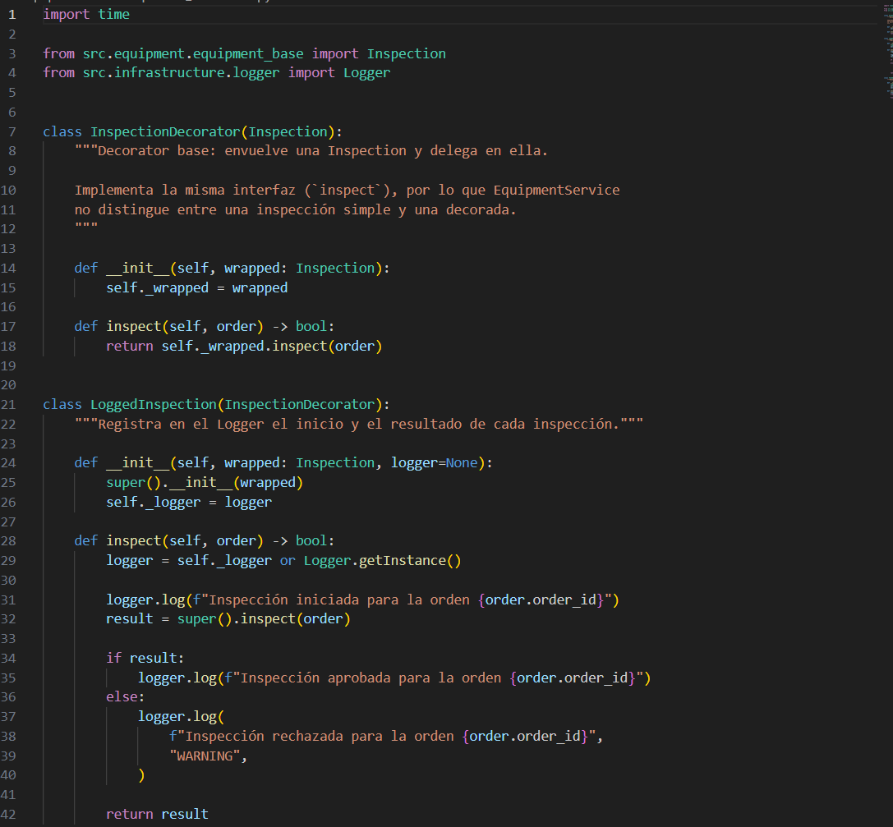

| Clase | Responsabilidad |
| ----- | --------------- |
| `InspectionDecorator` | Base común: recibe la inspección envuelta y delega `inspect()`. |
| `LoggedInspection` | Registra en el `Logger` el inicio de la inspección y su resultado, con el identificador de la orden. Si el resultado es `False`, registra con nivel `WARNING`. |
| `TimedInspection` | Mide con un reloj la duración de `inspect()` y la deja disponible en `last_duration`, incluso si la inspección lanza una excepción. |

### Decisiones de diseño

* **Dependencias inyectables:** `LoggedInspection` recibe opcionalmente un `logger` (por defecto usa `Logger.getInstance()`) y `TimedInspection` recibe un `clock` (por defecto `time.perf_counter`). Esto permite probar los decoradores sin depender del archivo de log ni del tiempo real.
* **El resultado nunca se altera:** los decoradores devuelven exactamente lo que devuelve la inspección envuelta.
* **Orden de apilado:** al combinarlos, el decorador más externo se ejecuta primero. En `LoggedInspection(TimedInspection(inspección))`, el registro rodea a la medición.

### Cómo se aplica

La inspección se envuelve desde fuera, sin tocar `EquipmentService`, porque el servicio expone su inspección como atributo:

```python
timed = TimedInspection(equipment.inspection)
equipment.inspection = LoggedInspection(timed)

resultado = equipment.run_inspection(plantilla)
print(timed.last_duration)
```

### Integración con los demás patrones

* **Abstract Factory:** sigue creando la inspección base; los decoradores se aplican sobre lo que la fábrica entrega.
* **Singleton + Adapter:** `LoggedInspection` usa `Logger.getInstance()`, que a su vez delega en `StandardLoggingAdapter`. Por eso el nivel `WARNING` de los rechazos llega a `logging` y queda en `mes.log`, algo que el Logger original no permitía.

---

## Uso y prueba de ejecución

Salida obtenida al ejecutar `main.py` (se omiten las marcas de tiempo del log):

```text
=== DECORATOR - INSPECCIÓN CON REGISTRO Y MEDICIÓN DE TIEMPO ===
[INFO] Inspección iniciada para la orden OP-002
Inspección dimensional realizada
[INFO] Inspección aprobada para la orden OP-002
[INFO] Inspección de CNCMachine: True
Resultado de la inspección: True
Duración medida: 0.000003 s
```

Se observa que el mensaje `Inspección dimensional realizada` (de la inspección original) queda rodeado por los registros del decorador, y que el registro de resumen de `EquipmentService` se mantiene sin cambios.

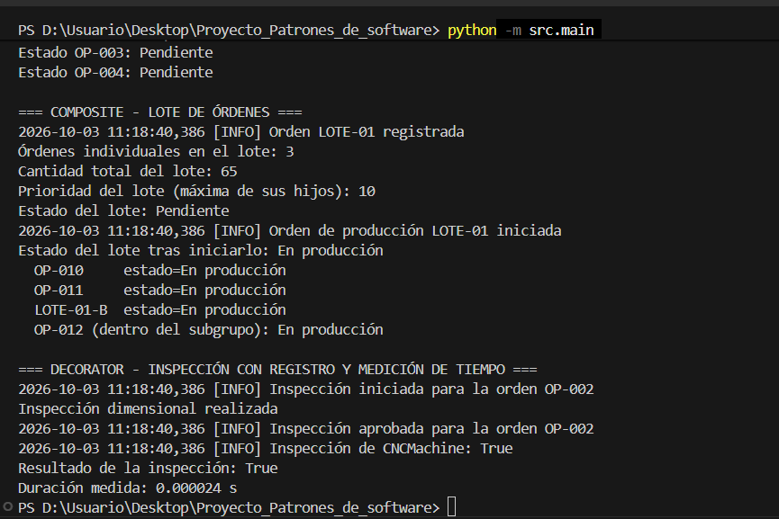

---

## Pruebas automatizadas

Archivo: `tests/test_inspection_decorators.py` (6 pruebas).

Se verificó que:

* Una inspección decorada sigue siendo una `Inspection`.
* `LoggedInspection` registra el inicio y la aprobación con nivel `INFO`.
* `LoggedInspection` registra con nivel `WARNING` cuando la inspección es rechazada.
* `TimedInspection` calcula la duración con un reloj inyectado.
* Los decoradores se pueden apilar y conservan el resultado.
* `EquipmentService` funciona con una inspección decorada sin ninguna modificación.

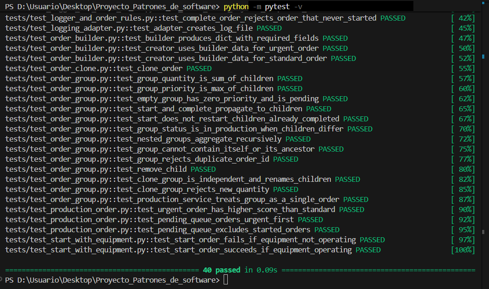

Resultado total del proyecto: **40 pruebas superadas**.

---

## Limitaciones

* Las inspecciones actuales siempre devuelven `True`, por lo que el nivel `WARNING` solo se observa con inspecciones que fallen (como la usada en las pruebas).
* `EquipmentService.run_inspection()` mantiene su propio registro de resumen, por lo que ambos mensajes conviven en el log.
* Los decoradores se aplican manualmente (en `main.py`). Una mejora futura sería que la fábrica entregue la inspección ya decorada.
* Si se agregaran más decoradores que dependan del orden de apilado, ese orden debería documentarse.

## Aplicaciones evaluadas y no implementadas

* **Decorator sobre `ProductionOrder`** (por ejemplo, ajustar la prioridad según la fecha de entrega): las órdenes tienen estado mutable, se copian con `deepcopy` y `ProductionService` accede directamente a sus atributos. Un decorador tendría que delegar todo ese comportamiento y complicaría `clone()`. Además, hoy solo existen dos niveles de prioridad, por lo que no hay variaciones que combinar.
* **Decorator sobre `Logger`:** ya es un Singleton y el Adapter le aportó niveles y persistencia; envolverlo agregaría una capa sin resolver una necesidad actual.

---

## Diagrama UML

*(Incluye únicamente las clases que participan en este patrón.)*

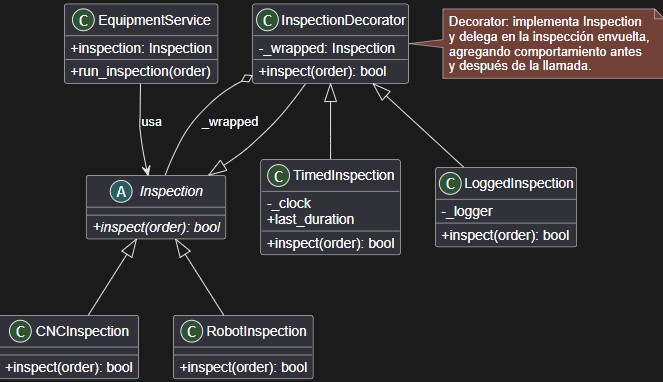

Código PlantUML utilizado (planttext.com):

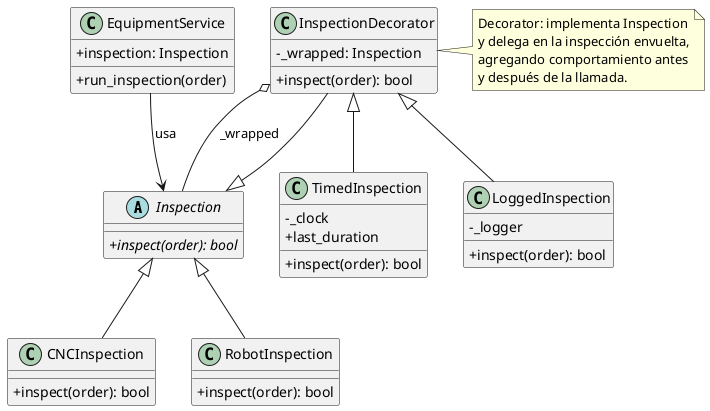
```plantuml
@startuml
skinparam classAttributeIconSize 0

abstract class Inspection {
  +{abstract} inspect(order): bool
}

class CNCInspection {
  +inspect(order): bool
}

class RobotInspection {
  +inspect(order): bool
}

class InspectionDecorator {
  -_wrapped: Inspection
  +inspect(order): bool
}

class LoggedInspection {
  -_logger
  +inspect(order): bool
}

class TimedInspection {
  -_clock
  +last_duration
  +inspect(order): bool
}

class EquipmentService {
  +inspection: Inspection
  +run_inspection(order)
}

Inspection <|-- CNCInspection
Inspection <|-- RobotInspection
Inspection <|-- InspectionDecorator
InspectionDecorator <|-- LoggedInspection
InspectionDecorator <|-- TimedInspection
InspectionDecorator o-- Inspection : _wrapped
EquipmentService --> Inspection : usa

note right of InspectionDecorator
  Decorator: implementa Inspection
  y delega en la inspección envuelta,
  agregando comportamiento antes
  y después de la llamada.
end note
@enduml
```


---

# Estado del proyecto

Con este avance, el proyecto cuenta con nueve patrones de diseño analizados, de los cuales ocho están implementados:

### Singleton
Implementado para centralizar el registro de eventos mediante `Logger`, con garantía de instancia única.

### Factory Method
Implementado para separar la creación de diferentes tipos de órdenes de producción.

### Abstract Factory
Implementado para la creación de familias completas de equipos de producción (línea CNC y línea robótica).

### Builder
Implementado para construir órdenes de producción con datos opcionales de forma flexible.

### Prototype
Implementado para clonar órdenes de un mismo lote a partir de una orden plantilla.

### Adapter
Implementado para integrar el módulo estándar `logging` de Python al Logger centralizado, sin modificar la interfaz existente.

### Bridge
Evaluado y **no implementado** en esta etapa: no se identificó una necesidad real de separar dos dimensiones de variación independientes (ver justificación en la sección correspondiente).

### Composite
Implementado para agrupar órdenes de producción en lotes y sublotes mediante `OrderGroup`, que se comporta como una `ProductionOrder` y propaga `start()`, `complete()` y `clone()` a sus hijos, además de calcular la cantidad total y la prioridad del grupo. No requirió modificar `ProductionService`.

### Decorator
Implementado para extender las inspecciones de los equipos con registro de eventos (`LoggedInspection`) y medición de tiempo (`TimedInspection`), sin modificar las inspecciones concretas ni `EquipmentService`.

---

# Conclusión general

La evolución del proyecto ha seguido una misma disciplina en cada etapa: identificar un problema real del dominio antes de introducir un patrón, y documentar también cuándo un patrón **no** se justifica, como ocurrió con Bridge en esta etapa.

Con Factory Method, Abstract Factory, Builder y Prototype se fue enriqueciendo progresivamente el modelo de órdenes y equipos del MES. Con Adapter, se resolvió una limitación real de infraestructura (el Logger sin niveles ni persistencia) sin alterar el resto del sistema, demostrando que un patrón estructural puede incorporarse de forma no invasiva sobre una base ya construida.

Con Composite y Decorator se confirmó esa misma idea. Composite resolvió una carencia real del modelo: el lote de órdenes era solo un texto guardado en cada orden, sin estructura propia, por lo que iniciar un lote obligaba a operar orden por orden. Con `OrderGroup`, un lote (o un sublote) se trata como una `ProductionOrder` más. Decorator resolvió la imposibilidad de ampliar las inspecciones sin modificarlas: `LoggedInspection` y `TimedInspection` agregan registro y medición de tiempo, y se pueden combinar sin crear una subclase por cada combinación. Ambos se incorporaron sin modificar `ProductionService`, `EquipmentService` ni las clases existentes.

También se evaluaron y descartaron otras aplicaciones que no resolvían un problema actual: Decorator sobre las órdenes de producción y sobre el `Logger`, y Composite sobre los equipos. Esto refuerza el criterio aplicado desde Bridge: un patrón se incorpora cuando hay una necesidad concreta, no para cumplir una estructura teórica.

Con los patrones Singleton, Factory Method, Abstract Factory, Builder, Prototype, Adapter, Composite y Decorator implementados y probados (40 pruebas automatizadas en total), y con Bridge evaluado y justificado como no aplicable, el proyecto cuenta con una base organizada y escalable.

---

# 25. Correcciones y cambios generales

Esta sección consolida los ajustes y correcciones realizados sobre el código durante el desarrollo del proyecto, independientemente del patrón en el que se originaron.

* Se configuró `pytest.ini` en la raíz del proyecto (`pythonpath = .`) para que las pruebas resuelvan correctamente los imports internos del paquete `src`.

* Se corrigió la garantía de instancia única del Singleton: el control se trasladó de `__init__` a `__new__`, ya que instanciar `Logger()` directamente podía generar una segunda instancia. Se agregó una prueba automatizada que valida esta garantía.

* `ProductionOrder` se convirtió en clase abstracta real (`ABC`), con `get_priority_score()` como método abstracto, impidiendo instanciarla directamente.

* Se agregaron validaciones de reglas de negocio en `ProductionService`: `add_order()` rechaza un `order_id` duplicado, `start_order()` solo es válido si la orden está en estado `"Pendiente"`, y `complete_order()` solo si está en estado `"En producción"`.

* Se amplió `ProductionOrder` con los campos opcionales `lote`, `fecha_ingreso`, `fecha_entrega`, `descripcion` y `equipo_asignado` (valor por defecto `None`, sin afectar el comportamiento previo), como base para el patrón Builder.

* Se agregó `start_order_with_equipment()` en `ProductionService`, que valida que el equipo asignado esté en estado `"Operando"` antes de iniciar una orden. `start_order()` se mantiene sin cambios para los casos que no requieren esta validación.

* Se actualizó `main.py` para reflejar en la ejecución los datos construidos por el Builder y el uso de `get_pending_queue()`.


* Se agregó el método `clone()` en `ProductionOrder` (patrón Prototype), cubierto por pruebas automatizadas que verifican independencia de la copia y reinicio forzado del estado a `"Pendiente"`.

* Todas las correcciones anteriores quedaron cubiertas por pruebas automatizadas.

* Se implementó `StandardLoggingAdapter` para integrar `logging` de Python al `Logger` existente; se detectó y corrigió un problema de aislamiento entre loggers de distinto archivo (`logging.getLogger` es un registro global por nombre), cubierto por prueba automatizada.

* Se implementó `OrderGroup` (patrón Composite) en `src/production/order_group.py`. Para que el grupo fuera consistente con sus hijos, `quantity` y `status` no se almacenan sino que se calculan a partir de ellos. `start()` solo inicia los hijos en estado `"Pendiente"` y `complete()` solo completa los que están `"En producción"`, evitando reiniciar órdenes ya completadas. Además, `add()` rechaza identificadores duplicados y ciclos (un grupo no puede contenerse a sí mismo ni a sus ancestros), y `clone()` renombra los hijos con un sufijo para no duplicar identificadores y rechaza `new_quantity`, porque la cantidad del grupo depende de sus órdenes.

* Se implementaron `InspectionDecorator`, `LoggedInspection` y `TimedInspection` (patrón Decorator) en `src/equipment/inspection_decorators.py`. Se hicieron inyectables el `logger` y el `clock` para poder probar los decoradores sin depender del archivo de log ni del tiempo real, y `TimedInspection` registra la duración incluso si la inspección lanza una excepción. Las inspecciones concretas y `EquipmentService` no se modificaron.

* Se actualizó `main.py` con dos secciones nuevas que muestran en ejecución el lote de órdenes (Composite) y la inspección decorada (Decorator).

* Se agregaron 19 pruebas automatizadas (13 para Composite y 6 para Decorator), con lo que el proyecto pasa de 21 a 40 pruebas superadas.
